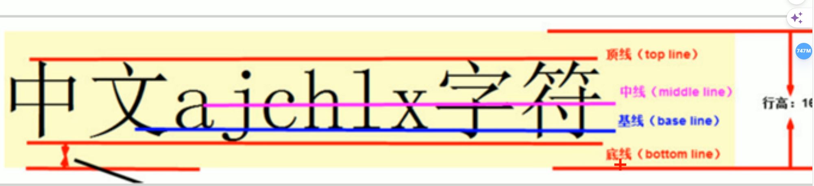

## 精灵图

一个网页中往往会应用很多小的背景图像作为修饰，当网页中的图像过多时，服务器就会频繁地接收和发送请求图片，造成服务器请求压力过大，这将大大降低页面的加载速度。
因此，为了有效地减少服务器接收和发送请求的次数，提高页面的加载速度，出现了CSS精灵技术（也称CSS Sprites、CSS 雪碧）。

==核心原理：将网页中的一些小背景图像整合到一张大图中，这样服务器只需要一次请求就可以了。==

1. 精灵图主要针对于小的背景图片使用。
2. 主要借助于背景位置来实现---background-position。
3. 一般情况下精灵图都是负值。（千万注意网页中的坐标：x轴右边走是正值，左边走是负值，y轴同理。

## 字体图标

精灵图是有诸多优点的，但是缺点很明显
1. 图片文件还是比较大的。
2. 图片本身放大和缩小会失真
3. 一旦图片制作完毕想要更换非常复杂。

此时，有一种技术的出现很好的解决了以上问题，就是字体图标iconfont。
字体图标可以为前端工程师提供一种方便高效的图标使用方式，展示的是图标，本质属于字体。

**字体图标的优点**
- 轻量级：一个图标字体要比一系列的图像要小。一旦字体加载了，图标就会马上渲染出来，减少了服务器请求
- 灵活性：本质其实是文字，可以很随意的改变颜色、产生阴影、透明效果、旋转等
- 兼容性：几乎支持所有的浏览器，请放心使用R

**字体文件格式**

不同浏览器所支持的字体格式是不一样的，字体图标之所以兼容，就是因为包含了主流浏览器支持的字体文件。
1. TureType(.ttf)格式.ttf字体是Windows和Mac的最常见的字体，支持这种字体的浏览器有lE9+、Firefox3.5+、Chrome4+、Safari3+、Opera10+、iOS Mobile、Safari4.2+ ;
2. WebOpenFontFormat(.woff)格式woff字体，支持这种字体的浏览器有lE9+、Firefox3.5+、Chrome6+、Safari3.6+、Opera11.1+ ;
3. Embedded Open Type(.eot)格式.eot字体是IE专用字体，支持这种字体的浏览器有IE4+；
4. SVG(.svg)格式.svg字体是基于SvVG字体渲染的一种格式，支持这种字体的浏览器有Chrome4+、Safari3.1+、Opera10.0+、iOS Mobile Safari3.2+ ;

要使用字体图标需要在样式中引入对应的字体图标字体库
引入后还需要在要显示字体图标的标签内设置字体样式为对应引入的字体样式

如果工作中，原来的字体图标不够用了，我们需要添加新的字体图标到原来的字体文件中。把压缩包里面的selection.json从新上传，然后选中自己想要新的图标，从新下载压缩包，并替换原来的文件即可。

## 界面样式

#### 鼠标样式cursor

```css
选择器{cursor:pointer;}
```
设置或检索在对象上移动的鼠标指针采用何种系统预定义的光标形状

- default : 小白(默认)
- pointer : 小手
- move : 移动
- text : 文本
- not-allowed : 禁止

#### 轮廓线

给表单添加`outline:0;`或者`outline:none;`样式之后，就可以去掉默认的蓝色边框。

#### 放置拖拽文本域resize

```css
textarea{resize:none;}
```

文本域的开始标签和结束标签如果跨行的话在浏览器中的文本域开头会多一些空格

## vertical-align属性应用

CSS的vertical-align属性使用场景：经常用于设置图片或者表单(行内块元素）和文字垂直对齐。
官方解释：用于设置一个元素的垂直对齐方式，但是它**只针对于行内元素或者行内块元素有效**。

```css
vertical-align : baseline|top丨middle丨bottom
```

- baseline : 默认。元素放置在父元素的基线上。
- top : 把元素的顶端与行中最高元素的顶端对齐
- middle : 把此元素放置在父元素的中部。
- bottom : 把元素的顶端与行中最低的元素的顶端对齐。


**解决图片底部默认空白缝隙问题**

图片底侧会有一个空白缝隙，原因是行内块元素会和文字的基线对齐。

主要解决方法有两种：
1. 给图片添加vertical-align:middle|toplbottom等。（提倡使用的）
2. 把图片转换为块级元素display:block;

## 单行文本溢出显示省略号
```css
/*1．先强制一行内显示文本*/
white-space: nowrap;    //默认 normal 自动换行
/*2．超出的部分隐藏*/
overflow: hidden;
/*3．文字用省略号替代超出的部分*/
text-overflow: ellipsis;
```

### 多行文本溢出显示省略号
多行文本溢出显示省略号，有较大兼容性问题，适合于webKit浏览器或移动端（移动端大部分是webkit内核)
```css
overflow: hidden;
text-overflow:ellipsis;
/*弹性伸缩盒子模型显示大*/
display: -webkit-box;
/*限制在一个块元素显示的文本的行数*/
-webkit-line-clamp: 2;
/*1设置或检索伸缩盒对象的子元素的排列方式*/
-webkit-box-orient:vertical;
```

## 布局技巧

### margin负值的使用
当对一个盒子进行浮动设置的时候,多个盒子排序后他们的边框会像表格中的那样连着,即两个盒子相接触的边框比设置的边框值大,这是因为把两个边框的宽度都算进去了,此时可以使用margin设置为负值使盒子相接触的部分重叠
原理是在渲染的时候第一个盒子先靠左浮动,然后边框负值再减去,后面的盒子在靠左浮动的时候紧贴着前一个盒子边框,然后再取负值这样就会使边框重叠

但这样也会使边框样式受到影响
比如当光标进入到盒子内部时边框变色,如果使用负值margin就会导致被压住的边框看不到变色
此时可以:
1. 让每个盒子margin往左侧移动-1px正好压住相邻盒子边框
2. 鼠标经过某个盒子的时候，提高当前盒子的层级即可（如果没有有定位，则加相对定位（保留位置），如果有定位，则加z-index.(绝对定位不占有位置因此不能使用)

但如果盒子内部有绝对定位的话盒子就不能设置为相对定位了,可以设置`z-index`属性提高等级可以实现

# BFC

英语全称Block formotting contexts，翻译成中文就是“块级格式化上下文”

- IFC（inline formotting context）：翻译成中文就是行内格式化上下文”，也就是一块区域以行内元素的形式来格式化
- GFC（GrideLayout formotting contexts）：翻译成中文就是“网格布局格式化上下文"，将一块区域以grid网格的形式来格式化
- FFC（Flex formotting contexts）：翻译成中文就是“弹性格式化上下文"，将一块区域以弹性盒的形式来格式化

就是页面中的一块染区域，并且有一套属于自己的染规则，它决定了元素如何对齐内容进行布局，以及与其他元素的关系和相互作用。当涉及到可视化布局的时候，BFC提供了一个环境，HTML元素在这个环境中按照一定规则进行布局。

BFC是一个独立的布局环境，BFC内部的元素布局与外部互不影响

BFC是一个独立的布局环境，里外不影响，并不意味着布局没有章法，也是有一定规则的：
1. 内部的Box会在垂直方向一个接着一个地放置。
2. Box垂直方向上的距离由margin决定。属于同一个BFC的两个相邻的Box的morgin会发生重叠
3. 每个盒子的左外边框紧挨着包含块的左边框，即使浮动元素也是如此。
4. BFC的区域不会与浮动Box重叠。
5. BFC就是页面上的一个隔离的独立容器，容器里面的子元素不会影响到外面的元素，反之亦然。
6. 计算BFC的高度时，浮动子元素也参与计算。

这些规则和正常使用时是一样的，在一个标准流中body元素就是一个天然的BFC

**形成bfc的方式：**

| 元素或属性    | 属性值                     |
| -------- | ----------------------- |
| body     |                         |
| float    | left、right              |
| postion  | absolute、fixed          |
| overflow | auto、scroll、hidden      |
| display  | inline-block、table-cell |

**使用场景：**
解决以下问题
1. 解决浮动元素令父元素高度期调的问题
2. 非浮动元素被浮动元素覆盖

# 渐进式渲染

渐进式溫染，英文全称progressive rendering，也被称之为情性渲染，指的是为了提高用户感知的加载速度，以尽快的速度来呈现页面的技术，

### 骨架屏
在加载网络数据时，为了提升用户体验，通常会使用一个转圈图的loading动画，或者使用SkeleronScreen占位。相比与lopding动画，Skeleton Screen的效果要更生动

### 图片懒加载
所谓图片加载，顾名思义，就是先加载部分图片，剩余的图片等到需要的时候再加载。这在电商网站中尤其常见
比如一个电商网站，首屏通常会有很多的数据，清晰度较高的baner或轮播。页面非首屏部分会员很多商品夹着大量的图片。这是时候选择懒加载以保证首屏的流畅十分重要。

### 图片占位符
在网页加就的时候，某些图片还在请求中或者还未请求，这个时候就先找一个临时代替的图像，放在最终图像的位置上，但是这只是临时替代的图形，当围片数据准备好以后，会重新染真正的图形数据。

### 拆分网页资源
大部分用户不会用到一个网站的所有页面，但我们通常的做法却是把所有的功能都打包进一个很大的文件里面个bundlejs文件的大小可能会有几M，一个打包后的style.css会包含网站的一切样式，从CSS结柯正又到网站在各个版本的样式：移动端、平板、桌面、打印版等等。
但用户并不是一开始就需要所有的资源，所有我们可以对资源进行拆分，首先加敬那些关键的资源，其他的资源等到需要的时候再去加载它

# 性能优化
1. 使用id选择器r非常的高效。在使用id选择器的时候需要注意一点：因为d是唯一的，所以不需要既指定id又指定tagName
2. 选择器避免深层次的嵌套
3. 尽量不要使用属性选择器，属性选择器性能非常慢
4. 通常将浏览器前疆置于前面，将标准样式属性置于最后
5. 遵守CSSLint规则
6. 不要使用impoprt
7. 避免重排
