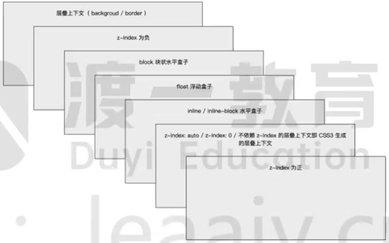

Cascading Style Sheets，层叠样式表
是一种用来为结构化文档（如 HTML 文档或 XML 应用）添加样式（字体、间距和颜色等）的计算机语言

css对样式的设定需要写在`<style></style>`标签中,style标签通常写在html的`<head></head>`标签中

对选择器更改的样式会一直作用在本文件中
其语法为:`选择器{样式}`,如:
```html
<style>
    p {
        color: red;
        font-size: 12px;
    }
</style>
```
这样在此页面中使用的`<p></p>`标签中的内容都变为红色,字体大小都为12像素了

## 字体设置

**字体**
属性front-family可以设置字体
```css
p{
	front-family:Arial,'Microsoft YaHei','微软雅黑';
}
```
可以设置多个字体,不同字体间使用逗号隔开,字体名称不是英文的或者是有多个英文单词拼成的需要用引号引用,多个英文单词之间还需要用空格隔开
设置多个字体浏览器会按先后顺序,如果前一个字体客户电脑上没有安装会往后查看,直到有电脑上安装的字体才会用该字体显示

**大小**
`front-size`设置文字大小
通常单位是像素
```css
front-size:16px;
```

**粗细**
`front-weight`设置文字粗细
```css
front-weight:300;
```
可以使用数字尺寸,可以使用默认给出的选项

**字体样式**
```css
front-style:normal;
```
通常只有两种normal是浏览器默认样式,italic是斜体
#### 复合属性
复合属性可以简写代码

如字体复合属性顺序:
```css
front:font-style font-weight font-size/line-height font-family;
```
复合属性值的顺序是不可改变的

用法:
```css
front:italic 700 16px/10px 'Microsoft yahei';
```
字体复合属性如果有些属性用不到可以省略,但大小和字体不能省略
```css
front:16px 'Microsoft yahei';
```

**行高**
```css
font:12px/1.5
```
设置字体为12像素乘行高的1.5倍

## 文本属性

**颜色**
```css
color:#ffffff;
```
可以使用颜色名blue,十六进制#ffffff,rgb值(255,255,255)

**对齐**
```css
text-align:center;
```
left,right,center

**装饰文本**
```css
text-decoration:underline;
```
none 默认,没有装饰线(最常用)
underline 下划线。链接a自带下划线 (常用)
overline 上划线。(几乎不用)
line-through 删除线。(不常用)

**文本缩进**
text-indent属性用来指定文本的第一行的缩进，通常是将段落的首行缩进
```css
text-indent:10px;
text-indent:2em;
```
em是一个相对单位，就是当前元素（font-size)1个文字的大小,如果当前元素没有设置大小，则会按照父元素的1个文字大小。

**行间距**
```css
line-height:10px;
```

## CSS引入方式

### 内部样式表
内部样式表（内嵌样式表）是写到html页面内部.是将所有的CSS代码抽取出来，单独放到一个\<style>标签中。
```css
<style>
	div{
		color:red;
		font-size:12px;
	}
</style>
```
- \<style>标签理论上可以放在HTML文档的任何地方，但一般会放在文档的\<head>标签中
- 通过此种方式，可以方便控制当前整个页面中的元素样式设置
- 代码结构清晰，但是并没有实现结构与样式完全分离
- 使用内部样式表设定CSS，通常也被称为嵌入式引I入，这种方式是我们练习时常用的方式

### 行内样式表
行内样式表（内联样式表）是在元素标签内部的style属性中设定CSS样式。适合于修改简单样式
```html
<div style="color：red；font-size：12px;">2024/9/10 16:11</div>
```
- style其实就是标签的属性
- 在双引号中间，写法要符合CSS规范
- 可以控制当前的标签设置样式
- 由于书写繁琐，并且没有体现出结构与样式相分离的思想，所以不推荐大量使用，只有对当前元素添加简单样式的时候，可以考虑使用
- 使用行内样式表设定CSS，通常也被称为行内式引I入

### 外部样式表
实际开发都是外部样式表.适合于样式比较多的情况.核心是：样式单独写到CSS文件中，之后把CSS文件引入到HTML页面中使用
引入外部样式表分为两步：
1. 新建一个后缀名为.css的样式文件，把所有css代码都放入此文件中。
2. 在HTML页面的\<head>标签中，使用\<link>标签引入这个文件。
```html
<link rel="stylesheet" href="css文件路径">
```
rel 定义当前文档与被链接文档之间的关系，在这里需要指定为"stylesheet"，表示被链接的文档是个样式表文件。
href 定义所链接外部样式表文件的URL，可以是相对路径，也可以是绝对路径。
使用外部样式表设定CSS，通常也被称为外链式或链接式引入，这种方式是开发中常用的方式

在.css文件中不需要写\<style>标签,因为这是html的语法,在.css文件中只需要写css语法就行了

# Emmet语法
Emmet语法的前身是Zencoding,它使用缩写，来提高html/css的编写速度，Vscode内部已经集成该语法
1. 快速生成HTML结构语法
2. 快速生成CSS样式语法

### 快速生成HTML结构语法
1. 生成标签直接输入标签名按tab键即可比如div然后tab键，就可以生成\<div>\</div>
2. 如果想要生成多个相同标签加上＊就可以了比如div\*3就可以快速生成3个div
3. 如果有父子级关系的标签，可以用〉比如ul>l就可以了
4. 如果有兄弟关系的标签，用+就可以了比如 div+p
5. 如果生成带有类名或者id名字的，直接写.demo或者#two tab 键就可以了
6. 如果生成的div类名是有顺序的，可以用自增符号$

### 快速生成CSS样式语法
CSS基本采取简写形式即可.
1. 比如w200按tab 可以生成width:200px;
2. 比如Ih26按tab 可以生成 line-height:26px;

# 元素显示模式的转换

CSS中分为三类显示模式:
1. 块元素显示模式(独占一行,触发范围是一整块)
2. 行显示模式(大部分都是文字,触发范围也只是文字范围)
3. 行内块显示模式(不独占一行的块)

如果想要在一个块或行内块的范围内触发与其中字体一样的触发效果就需要进行显示模式转换(即使行元素具有块元素的触发范围)增加字体点击范围(如果直接设置字体标签的大小也会改变文字的大小)

需要改变标签选择器中的属性
如:将a的触发范围改为块,将div触发范围改为行
```css
a {
    display: block;
}

div {
    display: inline;
}
```


# 三大特性

## 层叠性
相同选择器给设置相同的样式，此时一个样式就会覆盖（层叠）另一个冲突的样式。层叠性主要解决样式冲突

样式冲突，遵循的原则是就近原则，哪个样式离结构近，就执行哪个
样式样式不冲突，不会层叠

## 继承性
CSS中的继承：子标签会继承父标签的某些样式，如文本颜色和字号
和字体相关的都可继承包括行高
子元素可以继承父元素的样式（text-，font-，line-这些元素开头的可以继承，以及color属性）

## 优先级


当同一个元素指定多个选择器，就会有优先级的产生
- 选择器相同，则执行层叠性
- 选择器不同，则根据选择器权重执行


| 选择器           | 权重      |
| ------------- | ------- |
| 继承或者*         | 0,0,0,0 |
| 元素选择器         | 0,0,0,1 |
| 类选择器，伪类选择器    | 0,0,1,0 |
| ID选择器         | 0,1,0,0 |
| 行内样式style=""  | 1,0,0,0 |
| !important重要的 | 无穷大     |
在属性后面加`!import`就可以提高权重
```css
div{
	color:pink!important;
}
```

# CSS初始化

不同浏览器对有些标签的默认值是不同的，为了消除不同浏览器对HTML文本呈现的差异，照顾浏览器的兼容，我们需要对CSS初始化
简单理解：CSS初始化是指重设浏览器的样式。(也称为CSSreset）
每个网页都必须首先进行CSS初始化。

Unicode编码字体：
把中文字体的名称用相应的Unicode编码来代替，这样就可以有效的避免浏览器解释CSS代码时候出现乱码的问题。

比如：
黑体\\9ED1\\4F53
宋体\\5B8B\\4F53
微软雅黑\\5FAE\\8F6F\\96C5\\9ED1

# 特殊值
css中除了普通的值外，还提供了四种特殊值
1. inherit:该值将应用到选定元素的属性值设置为与其父元素一样。
2. initia：该值将应用到选定元素的属性值设置为与浏览器默认样式表中该元素设置的值一样。如果浏览器默认样式表中没有设置值，并且该属性是自然继承的，那么该属性值就被设置为inherit。
3. unset：该值将属性重置为其自然值，即如果属性是自然继承的，那么它就表现得像inherit，否则就是表现得像initiaf
4. revert：如果当前的节点没有应用任何样式，则将该属性恢复到它所拥有的值。换句话说，属性值被设置成自定义样式所定义的属性（如果被设置），否则属性值被设置成用户代理的默认样式，

# 引入
在css2.1中提供了import的语法，可以引入外部的css样式作用和style标签的link属性类似，它们的区别如下：

1. link属于HTML标签，而@import完全是CSS提供的一种方式。
link标签除了可以加载cSS外，还可以做很多其它的事情，比如定义RSS，定义rel定接属性等，@impor就只能加载CSS了。
2. 加载顺序的差别。
比如，在a.css中使用import引用b.css，只有当使用当使用import命令的宿主css文牛a.css被下载、解析之后，浏览器才会知道还有另外一个b.css需要下载，这时才去下截，然后下载后开始辩析、构建render tree等一系列操作
3. 兼容性的差别
由于@import是CSS2.1提出的所以老的浏览器不支持，@import只有在IE5以的才能识别。而ink标签无此问题。
4. 当使用JS控制DOM去改变样式的时候，只能使用link标签，因为@import不是DOM可以控制的
对于可换皮肤的网站而言，可以通过改变link便签这两个的href值改变应用不用的外部样式表，但是对于import是无法操作的，毕竟不是标签。

另外，从性能优化的角度来讲，尽量要避免使用@import。
使用@import引I入cS5会影响浏宽器的并行下载。使用@mporr引i用的CSS文件只有在引用它的那个CSS文件被下载、解析之后，浏简器才会知道还有另外一个CSS需要下载，这时才去下载，然后下载后开始解析、构建RenderTree等一系列操作。
多个@import会导致下载顺序紊乱。在IE中，@import会引发资源文件的下载顺序被打乱，即排列在@imporr后面的jS文件先于mpor下载，井且打乱甚至破坏import自身的井行下载。

# 层叠上下文
如果元素没有设置z-index的值，那么层叠顺序按元素的类型这样分类

子元素如果不做特殊处理默认和父元素在同一层级

### css3中属性对层叠上下文的影响
CSS3中出现了很多新属性，其中一些属性对层上下文也产生了很大的影响。如下：
1. 父元素的display属性值为flex｜inline-flex，子元素z-index属性值不为auto的时候，子元素为层叠上下文元素
2. 元素的opacity属性值不是1
3. 元素的transform属性值不是none
4. 元素mix-blend-mode属性值不是normal
5. 元素的filter属性值不是none
6. 元素的isolation属性值是isolate
7. will-change指定的属性值为上面任意
8. 元素的-webkit-overflow-scrolling属性值设置为touch
