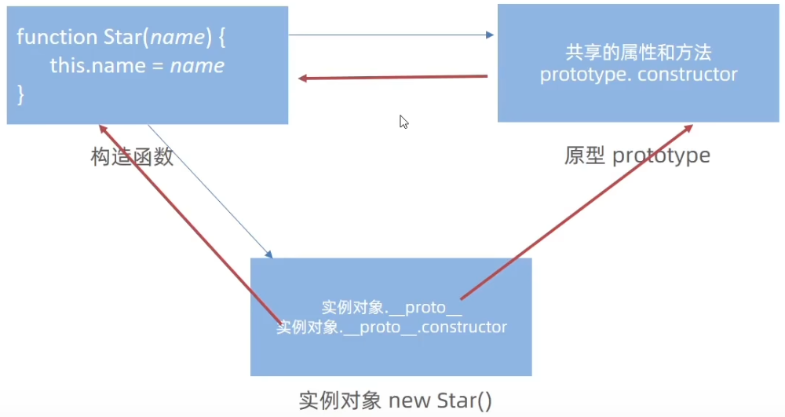
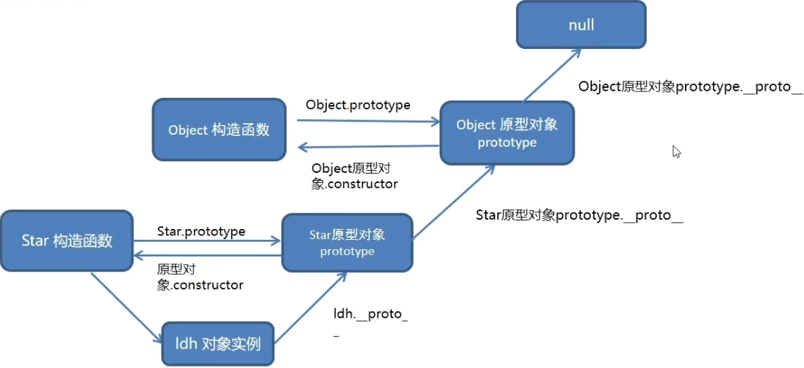

## Object的静态函数
Object中有许多静态函数可以使用

#### keys
获取对象中所有的键
```js
const 0 = { uname: 'pink', age: 18 }
//1.获得所有的属性名
console.log(Object.keys(o))//返回数组['uname','age']
```

#### values
获取对象中所有的属性值
```js
const 0 = { uname: 'pink', age: 18 }
//1.获得所有的属性名
console.log(Object.values(o))//返回数组['pink','18']
```

#### assign
静态方法常用于对象拷贝
经常使用的场景给对象添加属性
```js
//给○新增属性
const o = { name:'佩奇',age:6 }
Object.assign(o, { gender: '女' })
console.log(o) //{name:'佩奇', age: 6,gender:'女'}
```

# 数组
## 常见方法

| 方法      | 作用   | 说明                             |
| ------- | ---- | ------------------------------ |
| forEach | 遍历数组 | 不返回数组，经常用于查找遍历数组元素             |
| filter  | 过滤数组 | 返回新数组，返回的是筛选满足条件的数组元素          |
| map     | 迭代数组 | 返回新数组，返回的是处理之后的数组元素，想要使用返回的新数组 |
| reduce  | 累计器  | 返回累计处理的结果，经常用于求和等              |

#### reduce
reduce返回累计处理的结果，经常用于求和等
如果有起始值，则把初始值累加到里面
```js
arr.reduce(function(上一次值,当前值){},初始值)
```

示例:
```js
constarr[1,5,8]
const total = arr.reduce(function （prev, current) {
	return prev + current
})
console.Log(total)    //14
```

**执行过程**
1. 如果没有起始值，则上一次值以数组的第一个数组元素的值
2. 每一次循环，把返回值给做为下一次循环的上一次值
3. 如果有起始值，则起始值做为上一次值

### 其他常见方法
5. 实例方法join数组元素拼接为字符串，返回字符串(重点)
6. 实例方法去find查找元素，返回符合测试条件的第一个数组元素值，如果没有符合条件的则返回undefined(重点)
7. 实例方法every检测数组所有元素是否都符合指定条件，如果所有元素都通过检测返回true，否则返回false(重点)
8. 实例方法some检测数组中的元素是否满足指定条件如果数组中有元素满足条件返回true，否则返回false
9. 实例方法concat合并两个数组，返回生成新数组
10. 实例方法去sort对原数组单元值排序
11. 实例方法去splice删除或替换原数组单元
12. 实例方法reverse反转数组
13. 实例方法findIndex查找元素的索引值

# 字符串

### 常见方法
1. 实例属性 length用来获取字符串的度长(重点)
2. 实例方法split（'分隔符'）用来将字符串拆分成数组(重点)
3. 实例方法去substring（需要截取的第一个字符的索引l[，结束的索引号]）用于字符串截取(重点)
4. 实例方法startsWith（检测字符串[，检测位置索引号]）检测是否以某字符开头（重点）
5. 实例方法includes（搜索的字符串[，检测位置索引号]）判断一个字符串是否包含在另一个字符串中，根据情况返回true或false(重点)
6. 实例方法去toUpperCase用于将字母转换成大写
7. 实例方法去toLowerCase用于将就转换成小写
8. 实例方法indexof检测是否包含某字符
9. 实例方法去endsWith检测是否以某字符结尾
10. 实例方法replace用于替换字符串，支持正则匹配
11. 实例方法match用于查找字符串，支持正则匹配

# 对象

## 创建对象的三种方式

### 利用对象字面量创建
```js
const A={
	name:'pink',
	age:12
}
```

### 利用new Object创建

```js
const A=new Object({name:'pink',age:12})
```

### 利用构造函数创建
构造函数在技术上是常规函数，
不过有两个约定：
它们的命名以大写字母开头。
它们只能由"new”操作符来执行
```js
function Pig(name,age,gender){
	this.name = name
	this.age = age
	this.gener = gender
}
//创建佩奇对象
const Peppa =new Pig('佩奇',6,'女')
//创建乔治对象
const George =new Pig('乔治',3,'男')
```

构造函数没有返回值

构造函数在创建对象的时候每个对象都有它对应的构造函数,也就是说静态方法都有一份,这样就造成了内存的浪费
这个问题可以使用原型来解决
### 使用new关键字时做的事情
当使用new关键字时会先创建一个空对象,然后在这个空对象中使用构造函数,所以构造函数的this指针才会指向新的对象

#### 静态成员
构造函数的属性和方法被称为静态成员（静态属性和静态方法）

1. 静态成员只能构造函数来访问
2. 静态方法中的this指向构造函数

## 原型
### 原型对象
- 构造函数通过原型分配的函数是所有对象所共享的。
- JavaScript规定，每一个构造函数都有一个prototype 属性，指向另一个对象，所以我们也称为原型对象
- 这个对象可以挂载函数，对象实例化不会多次创建原型上函数，节约内存
- 我们可以把那些不变的方法，直接定义在prototype对象上，这样所有对象的实例就可以共享这些方法。
- 构造函数和原型对象中的this都指向实例化的对象

将共有的函数写在原型里面,将私有的属性写在构造函数里面
```js
function Star（uname,age）{
	this.uname=uname
	this.age=age
}
Star.prototype.sing=function(){
	console.log("唱歌")
}
```

**构造函数和原型对象中的this都指向调用自己的实例化的对象**

### constructor
每个原型对象里面都有个constructor属性（constructor构造函数）
该属性指向该原型对象的构造函数

给原型批量添加函数
在对象里面函数的赋值是使用冒号的,
但如果直接这样做就是创造了一个新的类型取代了star中的prototype属性
```js
Star.prototype ={
	sing: function (){
		console.log('唱歌"）
	}
	dance: function(){
		console.log（‘跳舞）
	}
}
```

这时就需要让constructor重新指向构造函数,这样prototype属性就不会改变了
```js
Star.prototype ={
	//从新指回创造这个原型对象的构造函数
	constructor: Star,
	sing: function (){
		console.log('唱歌"）
	}
	dance: function(){
		console.log（‘跳舞）
	}
}
```

### 对象原型
对象都会有一个属性__proto__指向构造函数的prototype 原型对象，之所以我们对象可以使用构造函数prototype
原型对象的属性和方法，就是因为对象有__proto__原型的存在。

对象原型指向原型对象

- _proto_是Js非标准属性
- \[\[prototype]]和_proto__意义相同
- 用来表明当前实例对象指向哪个原型对象prototype
- _proto_对象原型里面也有一个constructor属性，指向创建该实例对象的构造函数

## 原型继承
继承是面向对象编程的另一个特征，通过继承进一步提升代码封装的程度，JavaScript中大多是借助原型对象实现继承的特性。

原型继承后也需要使用conrstructor指回对象
```js
Woman通过原型来继承Person
Woman.prototype = Person
//指回原来的构造函数
Woman.prototype.constructor =Woman
```

但如果要给子类添加公共的成员函数就不能在原型对象;上挂载了,因为这样的继承是浅拷贝,其他的子类以及父类的原型对象也都是这个地址

可以使用new关键字创建一个新的对象用于继承
```js
Woman.prototype =new Person()
```

## 原型链
基于原型对象的继承使得不同构造函数的原型对象关联在一起，并且这种关联的关系是一种链状的结构，我们将原型对象的链状结构关系称为原型链


**查找规则**

1. 当访问一个对象的属性（包括方法）时，首先查找这个对象自身有没有该属性。
2. 如果没有就查找它的原型（也就是_proto_指向的prototype原型对象)
3. 如果还没有就查找原型对象的原型（Object的原型对象）
4. 依此类推一直找到Object为止（null)
5. _proto_对象原型的意义就在于为对象成员查找机制提供一个方向，或者说一条路线
6. 可以使用instanceof 运算符用于检测构造函数的prototype属性是否出现在某个实例对象的原型链上

# 深拷贝和浅拷贝
浅拷贝和深拷贝只针对引用类型
1. 拷贝对象：Object.assgin(）/展开运算符{..obj}拷贝对象
```js
const obj={
	name:'pink',
	age:20
}
const o={}
Object.assgin(o,obj)
```

2. 拷贝数组：Array.prototype.concat或者[...arr]

## 深拷贝

### 通过递归实现深拷贝

### 使用js库lodash里面的cloneDeep函数

### 把对象转换为json字符串,拷贝后再解析为对象

# 异常处理
除了try...catch...finally,js还有debuger关键字用来异常处理
直接添加debuger关键字程序在允许时会在debugger位置停止,即打断点

# this
对象中并没有this,函数中才有this

箭头函数中的this与普通函数完全不同，也不受调用方式的影响，事实上箭头函数中并不存在this！
1. 箭头函数会默认帮我们绑定外层 this 的值，所以在箭头函数中 this 的值和外层的 this 是一样的
2. 箭头函数中的this引用的就是最近作用域中的this
3. 向外层作用域中，一层一层查找this，直到有this的定义


## 改变this的指向
JavaScript中还允许指定函数中this的指向，有3个方法可以动态指定普通函数中this的指向
- call()
- apply()
- bind()

### call
使用call方法调用函数，同时指定被调用函数中this的值
- thisArg：在fun函数运行时指定的this值
- arg1，arg2：传递的其他参数
- 返回值就是函数的返回值，因为它就是调用函数
```js
fun.call(thisArg,arg1,arg2,...)
```

使用:
将fn中的this重定向为obj对象
```js
const obj ={
	uname:'pink'
}
function fn(x, y) {
	console.log(this) // window
	console.log(x + y)
}
//1.调用函数
// 2。改变 this 指向
fn.call(obj,1, 2)
```

### apply

使用apply方法调用函数，同时指定被调用函数中this的值

- thisArg：在fun函数运行时指定的this值
- argsArray：传递的值，必须包含在数组里面
- 返回值就是函数的返回值，因为它就是调用函数
因此apply主要跟数组有关系，比如使用Math.max(）求数组的最大值
```js
fun.apply(thisArg,[argsArray])
```

使用:
将fn中的this重定向为obj对象
```js
const obj ={
	age:18
}
function fn(x,y) {
	console.log(this) // {age: 18}
	console.log(x + y)
}
// 1.调用函数
// 2。改变this指向
fn.apply(obj,[1,2])
```

### bind
bind()方法不会调用函数。但是能改变函数内部this指向

- thisArg：在fun 函数运行时指定的 this 值
- arg1，arg2：传递的其他参数sayHello()
- 返回由指定的this值和初始化参数改造的原函数拷贝（新函数）
因此当我们只是想改变this指向，并且不想调用这个函数的时候，可以使用bind，比如改变定时器内部的this指向.
```js
fun.bind(thisArg,argl,arg2,...)
```

```js
const obj ={
	age:18
}
function fn() {
	console.log(this)
}
const fun = fn.bind（obj)
fun()
```

# 防抖
单位时间内，频繁触发事件，只执行最后一次

# 节流
单位时间内，频繁触发事件，只执行一次

# WeakMap和WeakSet

## WeakMap弱图

WeokMop起源于Map，它们非常相似。但是，WeokMap具有很大的不同。

它的引用链接所指向的数据对象的连接或关系没有Map的连接或关系那么强，所以它是弱的。

**差异：**
1. 只有对象可以作为键
2. 很多Map的函数无法使用，只能使用：delete、get、has、set，不支持迭代的函数
3. gc清理引用时数据会被清理
```js
let John ={major:"math"}

const map = new Map()
const weakMap = new WeakMap()

map.set(John,'John')
weakHap.set(John,'John')

John =null;
```

当John对象被垃圾回收时，Map对象将保持引用链接，而WeakMop对象将丢失链接。

## WeakSet
1. WeokSet只能储存对象引用，不能存放值，而Set对象都可以
2. 只能使用：add、delete、has、clear函数
3. WeokSet对象中储存的对象值都是被弱引l用的，即垃圾回收机制不考虑WeakSer对该对象的引用，如果没有其他的变量或者属性引用这个对象值，则这个对象将会被垃圾回收掉，（不考虑该对象还存在与WeakSet中），所以WeokSet对象里有多少个成员元素，取决于垃级回收机制有没有运行，运行前后成员个数可能不一致，遍历结束之后，有的成员可能取不到，被垃圾回收了，因此ES6规定，WeokSet对象是无法被遍历的也没有办法拿到它包含的所有元素。

```js
let John={major::'math'}
const set=new Set()
const weakSet=new weakSet()
set.add(John)
weakSet.add(John)
John=null
```
一旦对象john被垃圾回收，WeakSer就无法访问其引l用John的数据。
而且WeakSer不支持for-of或forEoch，因为它不可选代。

# eval
会将传入的字符串当做js代码来执行
```js
eval('console.log(1)')
```

如果传入的不是js代码或者不是字符串，那么eval会将传入的值原封不动地返回

eval里面的代码在当前词法环境中执行，因此它可以看到外部变量
在严格模式下，evol有自己的词法环境。因此，在evol内部声明的函数和变量在外部不可见

以前，JavaScripr是一种弱得多的语言，很多事情只能用eval来完成。但那段时间已经过去
十年了。
现在，几乎没有理由使用eva。如果有人使用了它，那么一个更好的选择是用现代语言结构或javaScript模块替换它.

尽量不要使用eval：
- eval是一个危险的函数，它使用与调用者相同的权限执行代码。如果你用eval运行的字符串代码被恶意方修改。您最终可能会在您的网页/扩展程序的权限下，在用户计算机上运行恶意代码。（不安全）
- eval通常比其他替代方法更慢，因为它必须调用JS解释器，而许多其他结构则可被现代JS引擎进行优化。使用evar往往比普通JavaScripr代码慢几个数量级。（性能不好）
- 产生混乱的代码逻辑
