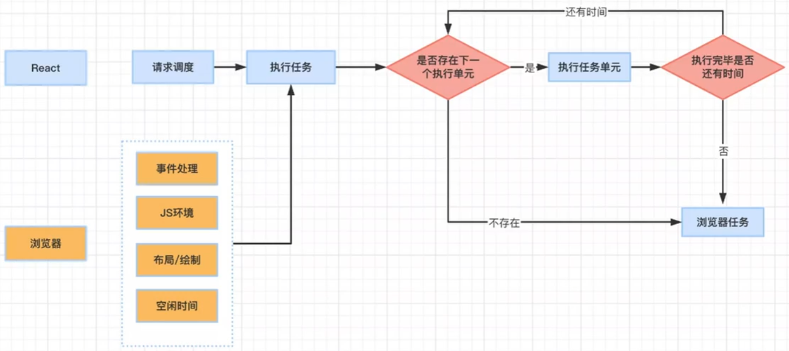
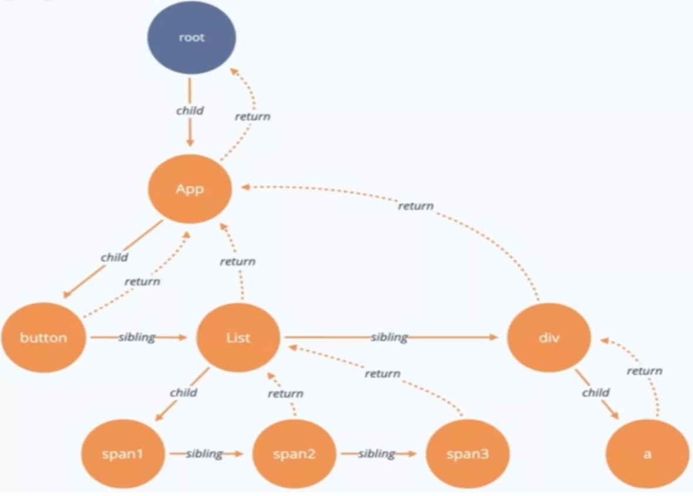

React最大的一个性能问题就是-React的某个组件的更新会连带着，他的子组件一起更新。

# 时间切片
Vue有依赖收集，做到了最小的更新范围，而React没有做这个事情。所以React要更新，就会有很大的diff算法比对和计算工作。
这大的更新量，虚拟dom比对和计算会花很大时间，这样可能会阻塞住浏览器的工作，导致页面长时间白屏。
React为了解决这个问题选择另一种策略-时间切片，也就是先计算一部分更新，然后让渡给渲染进程渲染，然后再进行下一步更新。以此往复。这样我从使用者的角度，就不会出现长时间白屏了。

保障在执行更新操作时计算时不能超过16ms，如果超过16ms，京就需要先暂停，让给浏览器进行渲染

## fiber
为了支持这种切片，我们需要把更新化成一个个单元，然后我们也必须有回复上一次计算进度的能力
所以react设计一种数据结构-fiber
每一个组件会被转化为一个fiber结构的对象，组成一个个单元。Fiber让我们有了回复上次中断的计算进度的能力

fiber有很多指针如：父元素、子元素、兄弟元素等，当计算中断后会记录下当前的节点，并在下次恢复后可以知道接下来该计算哪些数据

## 优化
- 对于类组件可以继承PurComponent。对于函数组件应尽量使用React.memo
- 避免state修改为同样的值，而产生无意义更新新（PureComponent,函数组件本身就会判断）
