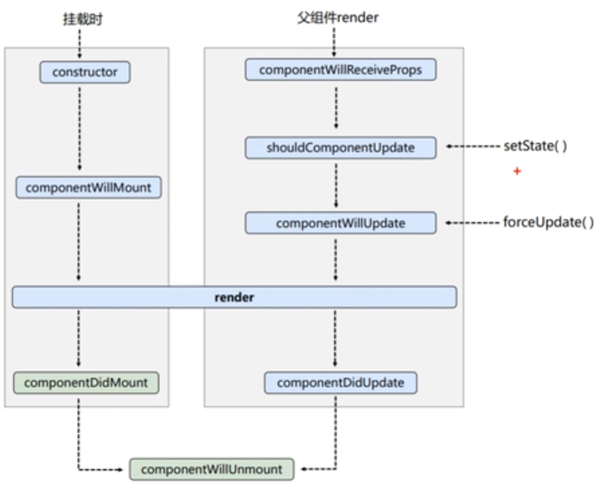
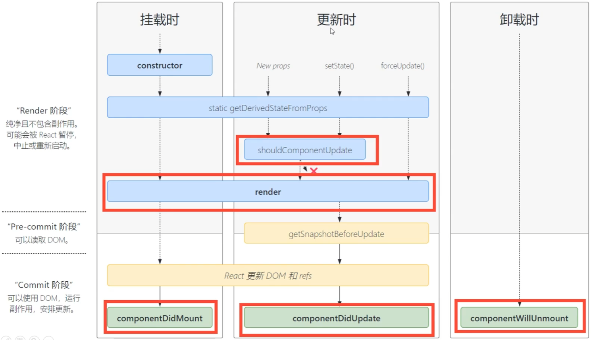

使用react语法的script标签type字段需要是`text/babel`，react依赖于babel将jsx语法编译为js语法

# 严格模式
严格模式只在开发模式下生效，生产上线时会去除，作用简要概括有两方面的作
用
1. 检测一些危险的操作(比如使用已经废弃api和不推荐的api)
2. 会把一些生命周期执行两次，来检测额外副作用（比如render)

## 渲染元素
```tsx
const vdom= <div>hello react</div> //创建虚拟节点
ReactDOM.render(vdom,选择器) //使用原生api查询到的选择器为挂载点，将虚拟dom渲染为真实dom挂载到挂载点上
```

# 语法规则
1. 定义虚拟DOM时，不要写引号。
2. 标签中混入JS表达式时要用大括号
3. 样式的类名指定不要用class，要用className。
4. 内联样式要用`style={{key1:val1,key2:val2}}`
5. 虚拟dom只能有一个根标签
6. 事件绑定只需要`on+事件名={函数名}`，如果函数需要传参需要使用匿名函数包裹
```tsx
const myData='hello'
function handleClick(n:number){
	console.log(`被点击:${n}`)
}

const vdom=(
	<div className='active' id={myData}>
		<h2 
		style={{color:'white',fontSize:'20px'}} 
		onClick={()=>{handleClick('1)}}>
			{myData}
		</h2>
	</div>
)
```

1. 通过onXxx属性指定事件处理函数（注意大小写）
	React使用的是自定义（合成）事件，而不是使用的原生DoM事件为了更好的兼容性
	React中的事件是通过事件委托方式处理的（委托给组件最外层的元素）为了的高效
2. 通过event.target得到发生事件的DoM元素对象不要过度使用ref

**卸载组件**
卸载查询到节点上的组件
```tsx
ReactDOM.unmountComponentAtNode(选择器)
```

## 空标签
react中组件只能有一个根标签，这个标签在编译时也是会正常编译成一个标签的，在vue中有template标签在编译时会被去除，在react中可以使用空标签实现
```tsx
function App(){
	render(){
		<>
			<div></div>
			<span></span>
		</>
	}
}
```


# 组件
组件的命名必须是首字母大写，如果是小写babel会解析成html默认标签

使用自定义组件包裹内容时，该内容会被当做标签体传入给props属性，在props属性中的名为children

**函数式组件和类式组件的区别**
1. 函数组件没有生命周期
2. 函数组件没有this
3. 函数组件通过hook来完成各种操作
4. 函数组件本身的函数体相当于render函数
5. props在函数的第一个参数接受

## 函数式组件
适用于简单组件

```tsx
function MyCom(){
	return <h2>函数式组件</h2>
}
ReactDOM.render(<MyCom/>,document.getElementById('root'))
```

过程：
1. React解析组件标签，找到了MyCom组件。
2. 发现组件是使用函数定义的，随后调用该函数
## 类式组件
适用于复杂组件

复杂组件就是有状态的
类式组件有一个类，这个类上有一个state属性要将数据放在状态中

必须继承`React.Component`类
其中有一个render函数，这个函数的返回值用于返回虚拟dom

```tsx
class MyCom extends React.Component{
	render(){
		//render是放在哪里的？一MyComponent的原型对象上，供实例使用。
		return <h2>类式组件</h2>
	}
}
ReactDOM.render(<MyCom/>,document.getElementById('root'))
```

过程：
1. React解析组l件标签，找到了MyComponent组件
2. 发现组件是使用类定义的，后new出来该类的实例，并通过该实例调用到原型上的render方法
3. 将render返回的虚拟DoM转为真实DoM，随后呈现在页面中

类中的函数默认开启了严格模式，所以类中的函数的this指向都是undefined，想要通过类的私有函数修改类的状态无法实现
可以在构造函数中调用bind函数给类的私有函数绑定上this并重新得到绑定好的函数
```tsx
class Weather extends React.Component{
	constructor(props){
		super(props)
		//初始化状态
		this.state ={isHot:false}
		this.changeWeather = this.changeWeather.bind(this)
	}
	render(){
		//读取状态
		const {isHot}= this.state
		return <h1 onClick={this.changeWeather}>今天天气很{isHot？‘炎热’：‘凉爽'}</h1>
	}
	changeWeather(){
		//changeWeather放在哪里？Weather的原型对象上，供实例使用
		//由于changeWeather是作为onClick的回调，所以不是通过实例调用的，是直接调用
		//类中的方法默认开启了局部的严格模式，所以changeWeather中的this为undefined
		this.setState({this.state.isHot=!this.state.isHot})
	}
}
//2.渲染组件到页面
ReactDoM.render(<Weather/>,document.getElementById('test'))
```
如果直接修改类中的状态，状态不是响应式的，需要使用setState设置可以实现数据的响应式更改
使用setState修改数据之后react还会再调用一次组件的render函数重新渲染

#### 简写形式
```tsx
class Weather extends React.Component{
	state ={isHot:false}
	render(){
		const {isHot}= this.state
		return <h1 onClick={this.changeWeather}>今天天气很{isHot？‘炎热’：‘凉爽'}</h1>
	}
	changeWeather=()=>{
		this.setState({this.state.isHot=!this.state.isHot})
	}
}
ReactDoM.render(<Weather/>,document.getElementById('test'))
```

# 组件之间传值

在react中组件间通信只有父子间的props传值
如果有其他的需求可以使用pubsub库的消息订阅和发布

## 父传子props
每个组件上有一个props属性，默认是空的，当传值给子组件时，react会收集传入的值放在子组件的props中
```tsx
class Person extends React.Component{
	render(){
		console.log(this);
		const {name,age,sex}=this.props
		return (
			<ul>
				<li>姓名：{name}</li>
				<1i>性别：{sex}</1i>
				<1i>年龄：{age}</1i>
			</ul>
		)
//演染组件到页面
ReactDoM.render(<Person name="jerry"age="19"sex="nan"/>,document.getElementById('test1'))
```
#### 限定props
可以限定props的类型以及是否必填
```tsx
Person.propTypes={
	name:PropTypes.string.isRequired  //字符串类型，且必传
}
```
PropTypes需要额外导入
还可以给props设定默认值，使用defaultProps属性
但props是只读的，不可以修改

### children
children是使用标签包裹是被包裹的内容
也是父传子的一种
```tsx
<MyCom><div>this is a component</div><MyCom>
```
在子元素的props中的children属性中

## 子传父
子传父通过事件绑定的方法实现
1. 在子组件中定义事件
```tsx
function Son({onGetSonMsg}){
	return(
		<div onClick={()=>{onGetSonMsg('hello')}}></div>
	)
}

function Father(){
	return(
		<Son onGetSonMsg={(msg)=>{console.log(msg)}}></Son>
	)
}
```

## 兄弟组件之间通信
兄弟组件之间通信可以先子传父将子组件的数据传递给父组件，再通过父传子再将数据传递给它的兄弟组件

## 组件的跨层级通信
1. 使用createContext函数创建一个上下文对象
2. 再顶层组件中通过Provider组件提供数据
3. 再底层组件中同挂useContext钩子函数获取消费数据
```tsx
const MsgContext=createContext()

function App (){
	return(
		<div>
			<MsgContext.Provider value={'hello'}>
				<A />
			</MsgContext.Provider>
		</div>
	)
}

function A (){
	return (
		<div>
			<B/>
		</div>
	)
}

function B (){
	const msg=useContext(MsgContext)
	return (
		<div>
		{msg}
		</div>
	)
}
```

## ref

### 字符串形式
使用ref标记组件内的虚拟节点，使用this.refs获取到虚拟节点转换成的真实dom
```tsx
class Weather extends React.Component{
	render(){
		return <h1 ref='btn' onClick={this.show}>Click</h1>
	}
	show=()=>{
		console.log(this.refs.btn)
	}
}
```

但字符串形式的性能比较差，后续也有可能弃用

### 回调函数形式的ref
在节点的ref上传入一个回调函数，回调函数的参数就是当前节点的对象，可以将这个节点对象挂载到当前类上来使用
```tsx
class Weather extends React.Component{
	render(){
		return <h1 ref={(curNode)=>{this.btn=curNode}} onClick={this.show}>Click</h1>
	}
	show=()=>{
		console.log(this.btn)
	}
}
```

但是这种内联形式的回调在频繁切换时会多次调用，可以将函数挂载到类上再绑定ref
```tsx
class Weather extends React.Component{
	saveInput=(curNode)=>{
		this.btn=curNode
	}
	render(){
		return <h1 ref={saveInput} onClick={this.show}>Click</h1>
	}
	show=()=>{
		console.log(this.btn)
	}
}
```
这样不是内联形式的回调函数可以避免这种问题，react在切换时会查看类上面是否有这个属性，如果有就不会再调用了
不管内联属性的性能消耗也不大

### createRef
在类的构造时调用createRef会返回一个容器，将这个容器保存在自己定义的一个属性上，在虚拟dom的ref上绑定这个容器，当虚拟dom转换为真实dom时会自动将当前真实dom的节点存储到这个容器中
但这个容器只能存储一个ref，后续绑定的ref会覆盖前面的ref，如果有多个ref需要创建多个容器
```tsx
class Weather extends React.Component{
	myRef=createRef()
	render(){
		return <h1 ref={this.myRef} onClick={this.show}>Click</h1>
	}
	show=()=>{
		console.log(this.btn)
	}
}
```

# 受控组件
react中并没有实现vue中的数据绑定，要想实现数据的绑定只能使用事件

# 事件回调函数接收多个参数
事件函数默认传入一个值是event，但有其他参数也要传递的情况

## 函数柯里化
```tsx
class Weather extends React.Component{
	myRef=createRef()
	render(){
		return <h1 onClick={handleClick(1)}>Click</h1>
	}
	handleClick=(n)=>{
		return (event)=>{
			console.log(n,event)
		}
	}
}
```

## 不使用函数柯里化的方式
```tsx
class Weather extends React.Component{
	myRef=createRef()
	render(){
		return <h1 onClick={(event)=>handleClick(1,event)}>Click</h1>
	}
	handleClick=(n,event)=>{
		console.log(n,event)
	}
}
```

# 生命周期
旧的

forceUpdate强制更新

新的



| 旧函数                       | 新函数                      | 作用                                                                                                     |
| ------------------------- | ------------------------ | ------------------------------------------------------------------------------------------------------ |
| constructor               | constructor              | 构造函数也是创建前的钩子，可以接收props的参数，如果设置这个生命周期必须在里面的头部调用super()，如果接收有props需要调用super(props)                       |
| componentWillReceiveProps | getDerivedStateFromProps | 将要从父组件中获取props数据。在新的生命周期中可以获取props参数，返回state数据，如果有返回的state会覆盖掉当前组件中的state。主要用于一个罕见东用例，即state的值取决于props |
| shouldComponentUpdate     | shouldComponentUpdate    | setState函数调用后调用的，有一个返回值如果返回false不允许更新，如果为true运行更新，默认为true                                              |
| componentWillMount        | -                        | 组件将要挂载                                                                                                 |
| componentWillUpdate       | getSnapsHotBeforeUpdate  | 组件将要更新，返回值是传递给componentDidUpdate的参数                                                                    |
| render                    | render                   | 组件更新                                                                                                   |
| componentDidMount         | componentDidMount        | 组件挂载完毕                                                                                                 |
| componentDidUpdate        | componentDidUpdate       | 组件更新完毕，有两个参数第一个参数时更新前的props，第二个参数时更新前的state，第三个参数是getSnapsHotBeforeUpdate的返回值，通常用于打开新页面时记录当前页面的视口位置    |
| componentWillUnmount      | componentWillUnmount     | 组件将要卸载                                                                                                 |

# 样式
在react中没有样式隔离，即在特定文件中引入样式打包时也依旧会打包到一起共同生效

要在react中实现样式隔离需要借用到css模块化
在写样式文件时命名为：`文件名+.modules.css`这样css在编译时会进行模块化，没有引入这个样式的文件将不会生效

# Fiber
fiber是react16引入的一种新的协调引擎，用于解决和优化react应对复杂ui渲染时的性能问题

它实现了4个具体目标
1. 时间切片渲染：将大型任务拆分成多个小的工作单元，在空闲时间执行这些小任务，但浏览器需要处理更高优先级的任务时可以暂停渲染，先处理优先级高的任务，然后再恢复未完成的渲染任务
2. 优先级调度：在fiber架构下react可以根据不同任务的优先级决定何时更新哪些部分，会优先处理优先级高的任务
3. 双缓存树：fiber架构中有两棵fiber树：当前正在渲染的fiber树（current fiber tree）和正在处理的fiber树（work in progress fiber tree），react会使用这两棵树保存更新前后的状态，从而更高效地进行比较和更新


