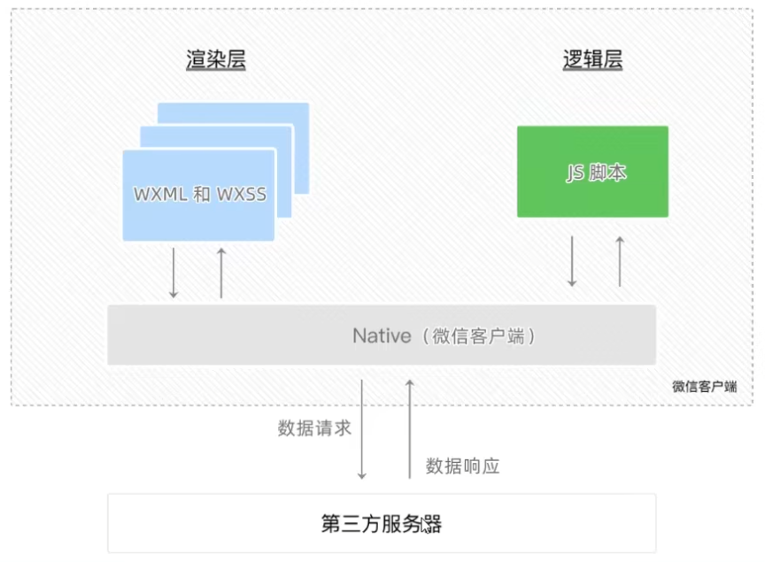

## 项目结构

文件
- .js 文件（页面的脚本文件，存放页面的数据、事件处理函数等)
- .json文件（当前页面的配置文件，配置窗口的外观、表现等）
- .wxml文件（页面的模板结构文件）
- .wxss文件（当前页面的样式表文件）

- pages 用来存放所有小程序的页面
- utils 用来存放工具性质的模块（例如：格式化时间的自定义模块）
- app.js 小程序项目的入口文件
- app.json 小程序项目的全局配置文件app.wxss小程序项目的全局样式文件
- project.config.json 项目的配置文件
- sitemap.json 用来配置小程序及其页面是否允许被微信索引

### app.json
app.json是当前小程序的全局配置，包括了小程序的所有页面路径、窗口外观、界面表现、底部tab 等。
4个配置项的作用：
1. pages：用来记录当前小程序所有页面的路径
2. window：全局定义小程序所有页面的背景色、文字颜色等
3. style：全局定义小程序组件所使用的样式版本
4. sitemapLocation：用来指明sitemap.json的位置

### project.config.json
project.config.json是项目配置文件，用来记录我们对小程序开发工具所做的个性化配置，例如：
1. setting中保存了编译相关的配置
2. projectname中保存的是项目名称
3. appid中保存的是小程序的账号ID

### sitemap.json
微信现已开放小程序内搜索，效果类似于 PC 网页的SEO。sitemap.json文件用来配置小程序页面是否允许微信索引。当开发者允许微信索引时，微信会通过爬虫的形式，为小程序的页面内容建立索引。当用户的搜索关键字和页面的索引匹配成功的时候，小程序的页面将可能展示在搜索结果中。

### wxml
WXML（WeiXin MarkupLanguage）是小程序框架设计的一套标签语言，用来构建小程序页面的结构，其作用类似于网页开发中的HTML。

### wxss
WXSS（WeiXinStyleSheets)是一套样式语言，用于描述WXML的组件样式，类似于网页开发中的CSS。

操作上和css大致相同,应尽量不使用小众的选择器

1. 新增了rpx尺寸单位
CSS中需要手动进行像素单位换算，例如rem
WXSS 在底层支持新的尺寸单位rpx，在不同大小的屏幕上小程序会自动进行换算

2. 提供了全局的样式和局部样式
项目根目录中的app.wxss会作用于所有小程序页面
局部页面的.WXSS样式仅对当前页面生效

3. WXSS仅支持部分CSS选择器
.class 和 #id
element
并集选择器、后代选择器
::after和::before等伪类选择器

### js
小程序中的JS 文件分为三大类，分别是：

1. app.js
是整个小程序项目的入口文件，通过调用App(）函数来启动整个小程序

2. 页面的.js 文件
是页面的入口文件，通过调用Page(）函数来创建并运行页面

3. 普通的 .js 文件
是普通的功能模块文件，用来封装公共的函数或属性供页面使用

# 操作
**添加页面**
直接在app.json中的pages属性中添加页面路径和名称即可自动添加页面

**切换首页**
在app.json中的pages属性中的页面,放在第一个的就是首页

# 宿主环境
宿主环境（hostenvironment）指的是程序运行所必须的依赖环境。例如：
Android系统和iOS系统是两个不同的宿主环境。安卓版的微信App是不能在iOS环境下运行的，所以，Android是安卓软件的宿主环境，脱离了宿主环境的软件是没有任何意义的！

# 通信模型

### 通信的主体
小程序中通信的主体是渲染层和逻辑层，其中：
WXML模板和WXSS样式工作在渲染层
JS 脚本工作在逻辑层

小程序中的通信模型分为两部分：
1. 渲染层和逻辑层之间的通信
由微信客户端进行转发\

2. 逻辑层和第三方服务器之间的通信
由微信客户端进行转发

# 运行机制

### 启动过程
1. 把小程序的代码包下载到本地
2. 解析app.json全局配置文件
3. 执行 app.js 小程序入口文件，调用 App(）创建小程序实例
4. 渲染小程序首页
5. 小程序启动完成

