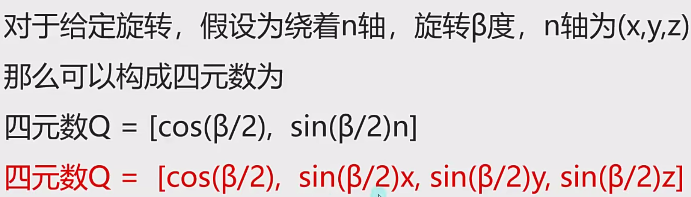
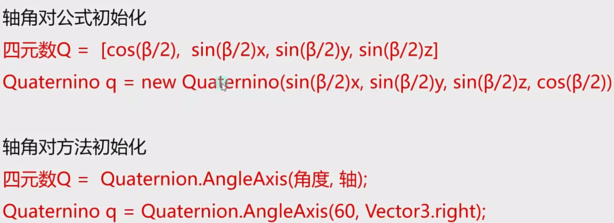

# 常用数学逻辑

## 数学库
Math是c#中封装好的用于数学计算的工具类一位于system命名空间中
Mathf是unity中封装好的用于数学计算的工具结构体一位位于unityEngine命名空间中

Mathf和Math中的相关方法几乎一样
Math是c#自带的工具类主要就提供一些数学相关计算方法
Mathf是unity专门封装的，不仅包含Math中的方法，还多了一些适用于游戏开发的方法

## 函数

| 函数                | 作用                                                                          |
| ----------------- | --------------------------------------------------------------------------- |
| Clamp             | 钳制函数。参数一：计算的目标值，参数二：最小值，参数三：最大值。目标值大于最大值取最大值，目标值小于最小值取最小值，目标值位于最小值和最大值之间取本身 |
| Lerp(start,end,t) | 插值函数：计算公式为：result=start+(end-start)\*t，t为插值系数。常用于一个物体跟随一个物体运动               |
| 三角函数              | 三角函数只能传入弧度值，使用时需要讲角度乘上转弧度再传入                                                |

## 插值运算

插值运算常有两种方式：
1. 一个物体先快后慢无限趋近于一点
```cs
Lerp(A.position,target.position,Time.deltaTime)
```
2. 一个物体匀速运动向一个点
```cs
float time=0;
time+=Time.deltaTime
Lerp(A.position,target.position,time)
```
当time>=1时到达目标点
但因为公式的性质，当time>=1时会到达目标点这时如果不对time清零再移动目标点那么运动的物体会直接瞬移到新的目标点

在Vector3中也提供了插值运算公式，使用方法一样

### 球型插值
在Vector中提供了球型插值运算公式Slerp


## 四元数

#### 欧拉角
heading-pitch-bank
是一种最常用的旋转序列约定
Y-X-Z约定
heading:物体绕自身的对象坐标系的Y轴,，旋转的角度
pitch:物体绕自身的对象坐标系的X轴旋转的角度
bank:物体绕自身的对象坐标系的Z轴，旋转的角度

**优点：**
直观、易理解
存储空间小 (三个数表示)
可以进行从一个方向到另一个方向旋转大于180度的角度
**缺点：**
同一旋转的表示不唯一
万向节死锁

**万向节死锁**
当某个特定轴达到某个特殊值时
绕一个轴旋转可能会覆盖住另一个轴的旋转
从而失去一维自由度

Unity中X轴达到90度时
会产生万向节死锁

**而四元数旋转不存在万向节死锁问题，因此在计算机中我们往往使用四元数来表示三维空间中的旋转信息**

四元数是简单的超复数
由实数加上三个虚数单位组成
主要用于在三维空间中表示旋转




| 函数                 | 作用                                                                                                                |
| ------------------ | ----------------------------------------------------------------------------------------------------------------- |
| AngleAxis(角度,轴)    | 绕某个轴旋转多少度                                                                                                         |
| Euler              | 欧拉角转四元数                                                                                                           |
| eulerAngles        | 四元数转欧拉角                                                                                                           |
| 插值函数               | 四元数中也提供了和Vector3同名的插值函数在四元数中Lerp和Slerp只有一些细微差别由于算法不同Slerp的效果会好一些，Lerp的效果相比Slerp更快但是如果旋转范围较大效果较差，所以建议使用Slerp进行插值运算 |
| LookRotation(面朝向量) | 将传入的面朝向量转换为对应的四元数值                                                                                                |

==四元数使用-180~180表示角度，-180和180是同一个角度==
==四元数相乘表示旋转四元数==

### 四元数相乘
==两个四元数相乘得到一个新的四元数代表两个旋转量的叠加==
相当于旋转
旋转相对的坐标系是物体自身坐标系

==四元数乘向量返回一个新向量相当于旋转向量==
相当于将这个向量旋转四元数对应的角度
可以将指定向量旋转对应四元数的旋转量

# 协程
unity中是支持多线程的，但新开的线程无法访问unity对象的内容（只能主线程中访问）
如果在unity中开启了新线程，那么游戏停止或编辑器退出时新线程也不会关闭，需要手动关闭开启的新线程（一般在OnDestory中）

协程的主要作用
将代码分时执行，不卡主线程
简单理解，是把可能会让主线程卡顿的耗时的逻辑分时分步执行

本质是一个迭代器

主要使用场景：
- 异步加载文件
- 异步下载文件
- 场景异步加载
- 批量创建时防止卡顿

### 协程函数
继承MonoBehavior的类都可以开启协程函数

**声明协程函数的关键点**：
1. 返回值必须是IEnumerator类型
2. 函数中通过yield return返回

协程函数分几部分都是根据yield return来的

**开启协程函数**
开启协程函数必须使用StartCoroutine函数开启，接收的是一个IEnumerator的返回值也就是协程函数的返回值
StartCoroutine返回的是一个Coroutine协程对象，可以根据这个对象关闭协程函数

**关闭协程函数**
StopAllCoroutines关闭所有协程
StopCoroutine(Coroutine c1)根据StartCoroutine返回的协程对象句柄关闭指定的协程

#### 使用yield return实现不同的效果
协程函数使用yield return可以返回任意类型的对象

**等待指定秒后执行**
```cs
yield return new WaitForSeconds(秒数);
```

**等待下一个固定物理帧更新时执行**
```cs
yield return new WaitForFixedUpdate();
```

**等待摄像机和GUI渲染完成后执行**
通常用于截图功能
```cs
yield return new WaitForEndOfFrame()
```

**跳出协程**
```cs
yield break;
```
此关键字所在的协程函数中该关键字后面的协程将不会被执行（协程函数执行完毕）


**协程受对象和组件失活的影响**：
当协程脚本依附的对象或协程脚本被销毁时协程不执行
当协程脚本依附的对象失活时协程不执行
当协程脚本依附的对象活跃时但协程脚本失活时协程执行

### 协程的原理

协程主要分为两部分
1. 协程函数本体
	协程本体就是一个能够中间暂停返回的函数
2. 协程调度器
	协程调度器是unity内部实现的，会在对应的时机帮助我们继续执行协程函数
	Unity只实现了协程调度部分
	协程的本体本质上就是一个C#的选代器方法

IEnumerator就是一个迭代器
也就是说可以自己调用迭代器的方法来控制协程函数
**迭代器向后移动一位**
返回值是布尔类型，true表示后面还有内容，false表示后面没有内容了
```cs
MoveNext()
```

**获取当前返回值**
可以获取到当前所在yield reutrn返回的值
```cs
Current
```

# 特殊文件夹

特殊文件夹就是在Assets文件夹下有固定名称的文件夹，它们有着不同的分工
**常用函数**

| 函数                   | 作用                    |
| -------------------- | --------------------- |
| Application.dataPath | 获取当前工程路径（通常用在编辑模式下使用） |

## Resources资源文件夹
如果一个工程中有多个Resources文件夹或者在不同的层级下他们都会被打包到一起
不可以通过路径获取的方式获取该文件夹，如果非要获取可以石笋获取到的工程路径+拼接的方式

- 将需要通过Resources相关API加载的动态资源放在里面
- 该文件夹下所有文件都会被打包
- 打包时unity会对其压缩加密
- 该文件夹打包后只读，只能通过Resources相关API加载

### 同步加载资源

如果不指定类型，只使用路径+名字的方式获取是不需要文件后缀名的，但如果在同一目录下有同名但不同扩展名的文件就需要使用第二个参数传入指定类型来正确加载资源
```cs
Resources.Load(资源路径+资源名字符串,Type)
```
加载的资源返回值都是unity命名空间下的Object类型，某些资源可能需要类型转换

加载指定名字的所有资源
```cs
Resources.LoadAll(资源路径+资源名字符串)
```

### 异步加载资源

在同步加载资源时
如果我们加载过大的资源可能会造成程序卡顿
卡顿的原因就是从硬盘上把数据读取到内存中中是需要进行计算的
越大的资源耗时越长，就会造成掉帧卡顿

1. 通过Resources提供的异步函数的方式加载
异步加载就是内部新开一个线程进行资源加载不会造成主线程卡顿

异步开一个新线程来加载资源，返回值是ResourceRequest类型，可以对返回值completed事件添加执行函数来执行完成后的逻辑
加载后的资源存放在ResourceRequest返回值的assets中
```cs
ResourceRequest rq = Resources.LoadAsync<类型>(资源路径+资源名字符串)
rq.completed+=LoadOver;

void LoadOver(AsyncOperation rq){
	print("加载完成");
	rq.assets;
}
```

好处：写法简单
坏处：只能在资源加载结束后进行处理
“线性加载”

1. 通过协程的方式加载
ResourceRequest也是继承了YieldInstruction
也是协程相关的类，在它内部unity设置好了yield return来分步，因此我们使用的时候直接yield reutrn资源即可
```cs
StartCoroutine("Load")

IEnumerator Load(){
	ResourceRequest rq = Resources.LoadAsync<类型>(资源路径+资源名字符串)
	yield return rq;
}
```
好处：可以在协程中处理复杂逻辑，比如同时加载多个资源，比如进度条更新
坏处：写法稍麻烦
“并行加载”

### 加载过程
该资源就一直存放在内存中作为缓存
第后面再加载时发现缓存中存在该资源
会直接取出来进行使用
所以多次重复加载不会浪费内存
但是会浪费性能（每次加载都会去查找取出，始终伴随一些性能消耗）

### 手动释放掉加载的资源
1. 卸载指定资源
该方法不能释放Gameobject对象因为它会用于实例化对象
它只能用于一些不需要实例化的内容 比如 图片和音效文本等等
即使是没有实例化的GameObject也不能被卸载
```cs
Resources.UnloadAsset
```

2. 卸载未使用资源
卸载所有未使用的资源
一般在跳转场景时和手动GC一起使用
```cs
Resources.UnloadUnusedAssets()
```

## StreamingAssets流动资源文件夹

可以通过`Application.streamingAssets`获取路径
但不能通过工程路径拼接的方式获取，因为打包后该文件夹在不同平台的路径是不一样的

- 打包后不会被压缩加密
- 在移动平台是只读的，pc平台可读可写
- 通常放任需要自定义动态加载的初始资源

## persistentData持久数据文件夹
在不同平台也是不一样的
可以通过`Application.persistentDataPath`获取路径

- 所有平台都可读可写
- 一般用于放置动态下载或者动态创建的文件，游游戏中创建或者获取的文件都放在其中

## Plugins插件文件夹
路径一般不获取

- 不同平台的插件相关文件放在其中（通常是sdk接入）

## Editor编辑器文件夹
一般不获取路径
可以通过工程路径拼接的方式获取

- 开发Unity编辑器时，编辑器相关脚本放在该文件夹中
- 该文件夹中内容不会被打包出去

## Standard Assets默认资源文件夹
一般不获取路径

- 一般Unity自带资源都放在这个文件夹下
- 其中的代码和资源优先被编译

# 异步加载场景
在切换场景时
Unity会删除当前场景上所有对象
并且去加载下一个场景的相关信息
如果当前场景对象过多或者下一个场景对象过多
这个过程会非常的耗时会让玩家感受到卡顿

## 1 通过事件回调函数异步加载
可以对处理完成的事件添加处理函数
```cs
AsyncOperation a = SceneManager.LoadScneAsync(场景名)
a.completed+=(a)=>{
	//处理逻辑
};
```
与资源异步加载不同，场景异步加载完不需要进行判断后再取出
场景异步加载完直接就跳转新场景了

## 2 通过协程异步加载
```cs
StartCoroutine(LoadScene(场景名))

IEnumerator LoadScene(string name){
	AsyncOpertaion a=SceneManager.LoadSceneAsync(name);
	yield return a;
}
```
异步类型的成员函数progress用于显示加载进度，但不太准确一般不用

# LineRenderer
划线

Loop是否终点起始自动相连
Positions线段的点线段宽度曲线调整
Color颜色变化
Corner Vertices（角顶点，圆角)此属性指示在一条线中绘制角时使用了多少额外的顶点。增加此值，，使线角看起来更圆
End Cap Vertices (终端顶点，圆角)终点圆角
Alignment对其方式
Texture Mode纹理模式
Alignment对其方式
Texture Mode纹理模式
Shadow Bias阴影偏移
Generate Lighting Data生成光源数据
Use World Space是否使用世界坐标系
Materials线使用的材质球
Lighting+光照影响
Probes光照探针
Additional Settings附加设置

# 范围检测

没有实体物体只想要检测在指定某一范围是否让敌方受到伤害时便可以使用范围判断

必备条件：想要被范围检测到的对象 必须具备碰撞器
1. 范围检测相关API只有当执行该句代码时进行一次范围检测它是瞬时的
2. 范围检测相关API并不会真正产生一个碰撞器只是碰撞判断计算而已

## 盒状范围检测

##### 1. 直接返回碰撞检测到的物体数组
参数一：立方体中心点
参数二：立方体三边大小
参数三：立方体角度
参数四：检测指定层级（不填检测所有层）
参数五：是否忽略触发器UseGlobal-使用全局设置collide-检测触发器Ignore-忽略触发器不填使用useGlabal
返回值：在该范围内的触发器（得到了对象触发器就可以得到对象的所有信息）
```cs
Physics.OverlapBox()
```
传入的层级是一个四字节的位数据（32bit），可以使用LayerMask.NameToLayer(层级名字符串)将层级名转化成二进制的数据并将1左移对应的位数，如果要同时判断多个层级需要使用位或操作符`|`

```cs
Collider[] colliders = Physics.OverlapBox( 
	Vector3.zero,
	Vector3.one,
	Quaternion.AngleAxis(45, Vector3.up),
	1<< LayerMask.NameToLayer("ui") | 1<< LayerMask.NameToLayer("Default"),
	QueryTriggerInteraction.UseGlobal
);
```

==关于层级==
通过名字得到层级编号LayerMask.NameToLayer
我们需要通过编号左移构建二进制数
这样每一个编号的层级都是对应位为1的2进制数
我们通过位运算可以选择想要检测层级
好处一个int就可以表示所有想要检测的层级信息

层级共有32个，每一个比特位都代表一个层级，在进行层级判断是使用位与来判断

##### 2. 返回检测到的数量
有一个Collider[]类型的传出参数，需要自己定义数组通过传出参数接收
返回值int是检测到范围内物体的数量
```cs
Physics.OverlapBoxNonAlloc()
```

## 球型范围检测
##### 1. 直接返回碰撞检测到的物体数组
参数一：中心点
参数二：球半径
参数三：检测指定层级（不填检测所有层）
参数四：是否忽略触发器UseGlobal-使用全局设置collide-检测触发器Ignore-忽略触发器不填使用useGlobal
返回值：在该范围内的触发器（得到了对象触发器就可以得到对象的所有信息）
```cs
Physics.OverlapSphere()
```

##### 2. 返回检测到的数量
```cs
Physics.0verlapSphereNonAlloc()
```

## 胶囊范围检测

##### 1. 直接返回碰撞检测到的物体数组
参数一：半圆一中心点
参数二：半圆二中心点
参数三：半圆半径
参数四：检测指定层级（不填检测所有层）
参数五：是否忽略触发器UseGlobal-使用全局设置collide-检测触发器Ignore-忽略触发器 不填使用useGlob
返回值：在该范围内的触发器（得到了对象触发器就可以得到对象的所有信息）
```cs
Physics.OverlapCapsule()
```
##### 2. 返回检测到的数量

```cs
Physics.OverlapCapsuleNonAlloc()
```

# 射线检测

它可以在指定点发射一个指定方向的射线
判断该射线与哪些碰撞器相交，得到对应对象

### 声明一条射线
参数一：起点
参数二：方向（一定记住不是两点决定射线方向，第二个参数直接就代表方向向量）
```cs
Ray r=new Ray()
```

**从摄像机发射出一条射线**
得到一条从屏幕位置作为起点
摄像机视口方向为方向的射线
```cs
Camera.main.ScreenPointToRay(Input.mousePosition);
```

### 射线检测
##### 1. 原始的射线检测
进行射线检测 如果碰撞到对象 返回true
参数一：射线
参数二：检测的最大距离超出这个距离不检测
参数三：检测指定层级（不填检测所有层）
参数四：是否忽略触发器UseGlobal-使用全局设置Collide-检测触发器Ignore-忽略触发器不填使用useGlobal
返回值：bool 当碰撞到对象时 返回 true 没有 返回false
```cs
Physics.Raycast(r,1000,1<< LayerMask.NameToLayer("Monster"),QueryTriggerInteraction.UseGlobal))
```
重载：把第一个参数射线变为起点和方向

很少使用，因为无法获取到检测到的对象信息

##### 2. 相交的单个物体信息

**物体信息类RaycastHint是一个结构体，结构体传入时需要使用out关键字**

| 属性        | 作用             |
| --------- | -------------- |
| collider  | 检测到的物体信息       |
| point     | 碰撞到的点          |
| normal    | 法线信息           |
| transform | 碰撞到的对象位置信息     |
| distance  | 射线发出的点到碰撞的点的距离 |

参数一：射线
参数二：RaycastHit是结构体 是值类型Unity会通过out 关键在 在函数内部处理后 得到碰撞数据后返回到该参数中
参数三：距离
参数四：检测指定层级（不填检测所有层）
参数五：是否忽略触发器UseGlobal-使用全局设置 Collide-检测触发器 Ignore-忽略触发器不填使用useGlobal
```cs
Physics.Raycast(r,out hitInfo,1000,1<< LayerMask.NameToLayer("Monster"),QueryTriggerInteraction.UseGlobal))
```

##### 2. 相交的多个物体
可以得到碰撞到的多个对象
如果没有就是容量为o的数组
参数一：射线
参数二：距离
参数三：检测指定层级（不填检测所有层）
参数四：是否忽略触发器UseGlobal-使用全局设置Collide-检测触发器Ignore-忽略触发器不填使用useGlobal
```cs
Physics.RaycastAll()
```

**返回碰撞到的数量，通过传出参数返回碰撞到的对象**
```cs
Physics.RaycastNonAlloc()
```
