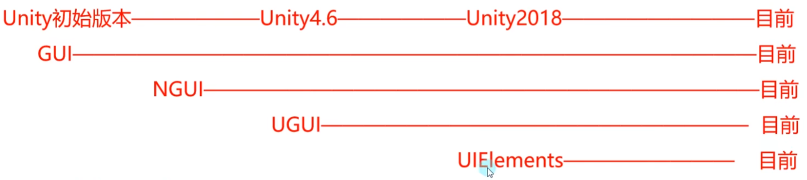

# IMGUI
全称即时模式游戏用户交互界面（IMGUI）在Unity中一般简称为GUI
它是一个代码驱动的UI系统

必须运行时才能看到，且不能自适应分辨率

要让gui在不运行时也能看到可以加上特性：`[executeaways]`

**主要作用**：
作为程序员的调试工具，创建游戏内调试工具
为脚本组件创建自定义检视面板
创建新的编辑器窗口和工具以拓展Unity本身（一般用作内置游戏工具）

制作gui的组件必须继承MonoBehaviour类，并将gui控件在OnGUI生命周期函数中绘制

它每帧执行相当于是用于专门绘制GUI界面的函数
一般只在其中执行GUI相关界面绘制和操作逻辑
该函数在OnDisable之前LateUpdate之后执行
只要是继承Mono的脚本都可L以在OnGUI中绘制GUI

gui的窗口起始位置是窗口左上角，xy轴正方形分别是向右向下

### 控件

| 函数               | 作用                                                                            |
| ---------------- | ----------------------------------------------------------------------------- |
| Label            | 标签控件，可以显示文字和图片，传入GUIStyle类型来控制gui样式                                           |
| Button           | 按钮控件                                                                          |
| Toggle           | 多选框，返回是否被选中                                                                   |
| TextField        | 普通输入框，返回输入框的内容                                                                |
| PasswordField    | 密码输入框，可以传入自定义的字符串用于代替密码字段                                                     |
| HorizontalSlider | 水平拖动条，返回的是一个浮点类型的当前值                                                          |
| VerticalSlider   | 竖直拖动条                                                                         |
| DrawTexture      | 图片绘制                                                                          |
| Box              | 框绘制                                                                           |
| Toolbar          | 工具栏                                                                           |
| SelectionGrid    | 选择网格                                                                          |
| Window           | 绘制窗口，传入的委托（函数指针）是创建的窗口中的组件                                                    |
| ModalWindow      | 模态窗口                                                                          |
| Color            | gui默认颜色                                                                       |
| skin             | 是一个guistyle的综合体，里面有各种控件的配置，给它设置了style后创建的gui控件都有skin的配置，如果再创建控件的时候更改会使用更改后的配置 |

### 分组
用于批量控制控件位置
可以理解为包裹着的控件加了一个父对象
可以通过控制分组来控制包裹控件的位置
`BeginGroup/EndGroup`两个函数之间包裹的控件即为一个分组 
分组中的控件只能显示在分组的范围内

### 滚动列表

### GUILayout布局

会自动布局其中的控件

| 函数                  | 作用                             |
| ------------------- | ------------------------------ |
| Begin/EndHorizontal | 声明布局的开始和结束，在这两个函数之间的控件都属于这个布局中 |

# NGUI

NGUI全称下一代用户界面(Next-Gen UI)
它是第三方提供的Unity付费插件
专门用于制作Unity中游戏UI的第三方工具
相对于GUI它更适用于制作游戏UI功能
更方便使用，性能和效率更高
Unity插件：是一种基于Unity规范编写出来的程序，主要用于拓展功能，简单理
解就是别人基于Unity写好的某种功能代码，我们可以直接用来处理特定的游戏
逻辑

**Unity最初版本~Unity4.6版本**
Unity官方只提供了GUI用于游戏UI的开发
所以更为高级和方便的NGUI是做UI的不二选择

**Unity4.6版本以后**
Unity官方招募NGUI作者加入Unity，协助Unity开发出UGUI系统用于游戏UI功能开发
由于UGUI刚推出后功能不够完善，所以经历了较长的过渡期，几乎到Unity5的时代才开始正式全面普及
