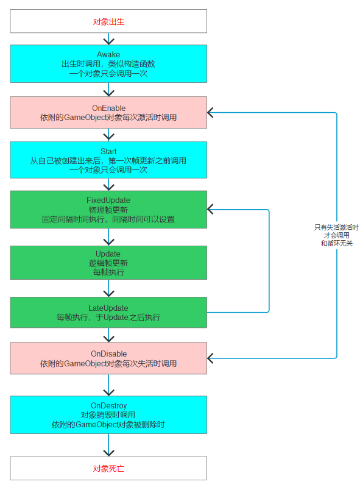
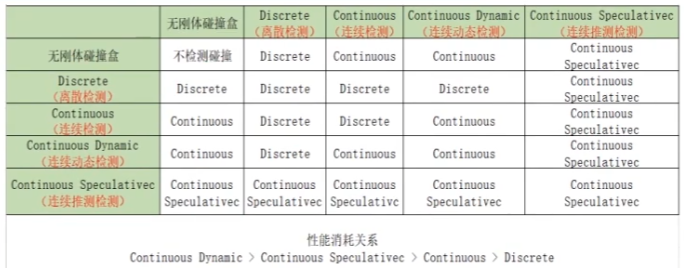
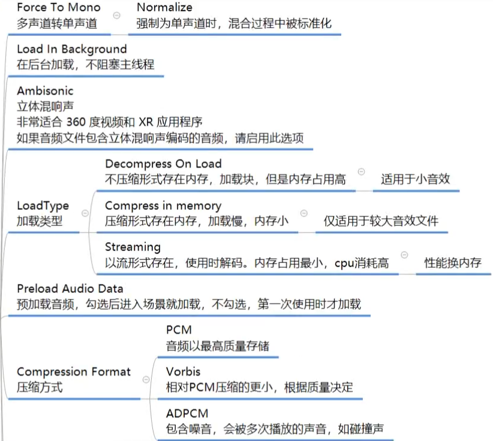
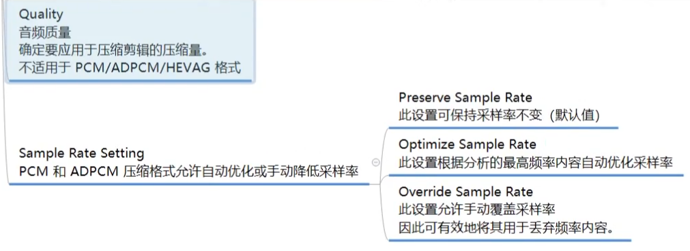

Unity引擎本质是一个软件使用它时是处于运行中的我们是在一个运行中的软件里制作游戏的Unity开发的本质就是在Unity引|擎的基础上利用反射和引擎提供的各种功能进行的拓展开发

程序正在运行时，可以查看其它程序集或者自身的元数据，一个运行的程序查看本身或者其它程序的元数据的行为就叫做反射

在程序运行时，通过反射可以得到其它程序集或者自己程序集中代码的各种信息，比如类，函数，变量，对象等等。我们可以实例化它们，执行它们，操作它们

虽然C#中没有强制要求类名和文件名必须同名，但在unity项目中类名和文件名必须一致，因为反射机制会通过文件名找Type所以如果不一致可能导致无法挂载

==在使用查找函数时可以使用`父亲对象名/子对象`的方法指定查找某个对象中的组件==
使用/分隔有继承关系的父子类名

# 图层
图层是作为一类事物的唯一标识符
如：需要相机拍摄某种事物，但又不想拍摄到镜头内的另一种事物可以过滤图层

# 预设体
从预设体创建的实例是跟随预设体一起更改的，预设体变化根据其创建的实例也会变化，还可以生成预设体变体，预设体变化时根据其生成的变体也会变化，变体可以单独设置其他属性再生成实例

# 脚本的生命周期
游戏的本质就是一个死循环，每一次循环处理游戏逻辑就会更新一次画面，之所以能看到画面在动是因为切换画面的速度到达一定时人眼就认为画面是流畅的，帧就是执行一次循环

所有继承MonoBehavior的脚本最终都会挂载到Gameobject游戏对象上
生命周期函数就是该脚本对象依附的Gameobject对象从出生到消亡整个生命周期中会通过反射自动调用的一些特殊函数
Unity帮助我们记录了一个Gameobject对象依附了哪些脚本会自动的得到这些对象，通过反射去执行一些固定名字的函数

> [!tip] Title
> 生命周期函数的访问修饰符一般为private和protected，都是Unity帮助我们调用的

# GameObject
GameObject继承自UnityEngine命名空间下的Objct类（和System下的object无关）

GameObject类对象是Unity引l擎提供给我们的作为场景中所有对象的根本在游戏场景中出现一个对象，unity中的所有对象都是继承自GameObject，同时也都默认携带Transform组件

unity各组件本质上是使用反射获取到它们的元数据来使用的

### Object
| 函数                | 作用                                                                                |
| ----------------- | --------------------------------------------------------------------------------- |
| FinedObjectOfType | 根据类型查找对象（不仅查找对象，也查找脚本效率比GameObject中的查找函数更低）                                       |
| Instantiate       | 创建一个对应的类型实例（通过该方法创建的对象实例名字后面会带有（clone））                                           |
| Destroy           | 删除一个指定对象，重载的有第二个参数是延迟多少秒删除。被删除的对象不会马上删除，而是标记上一个删除标记（画面上是立马消失的），等这一帧结束后才会真正删除。是异步的 |
| DestroyImmediate  | 会马上删除一个对象。是同步的                                                                    |
| DontDestroyOnLoad | 过场景不删除哪个对象。在切换场景时旧的场景中的所有对象都会被删除，该函数可以保证哪个对象在切换场景时不删除                             |

### 属性

| 属性         | 作用         |
| ---------- | ---------- |
| activeSelf | 是否为激活状态    |
| gameObject | 获取当前对象     |
| isStatic   | 是否为静态      |
| layer      | 自己的层级（int） |
| tag        | 标签         |
| transform  | 变换         |

### 函数

| 函数                      | 作用                                                                                         |
| ----------------------- | ------------------------------------------------------------------------------------------ |
| CreatePrimitive         | 创建自带几何体                                                                                    |
| Find                    | 从场景中所有对象查找某个对象，如果找到了返回这个对象，没找到返回空（效率比较低）。（以下特性后面两个查找函数也具有：无法找到失活对象，如果有多个符合条件的对象无法确定找到的是哪个） |
| FindWithTag             | 根据标签查找对象                                                                                   |
| FindGameObjectWithTage  | 和上一个完全一样                                                                                   |
| FindGameObjectsWithTage | 根据标签查找多个对象，也是无法找到激活对象                                                                      |
| FinedObjectOfType       | 根据类型查找对象                                                                                   |
| 构造函数                    | 可以使用new调用构造函数创造一个空物体                                                                       |
| AddComponent            | 为一个GO类添加组件                                                                                 |
| CompareTag              | 判断对象是否具有指定的标签，返回布尔类型                                                                       |
| 以下函数不常用                 | 效率比较低                                                                                      |
| SendMessage             | 通知自己执行指定名字的函数（会从自身挂载的所有脚本中去找，所有符合的函数都会调用）如果调用的函数有参数也需要调用时传参                                |
| BroadcastMessage        | 广播行为，让自己和自己的子对象执行                                                                          |
| SendMessageUpwards      | 向自己的父对象广播行为，让自己和自己的父对象执行                                                                   |

# MonoBehavior
1. 创建的脚本必须继承MonoBehavior类，否则无法挂载到GameObject对象上去（所有unity对象都继继承自GameObject也就是无法挂载到unity对象上去）
2. 继承了MonoBehavior的脚本不能new只能挂载
3. 继承了MonnBehavior的脚本不要去写构造函数，因为我们不会去new它，写构造函数没有任可意义
4. 继承了MonoBehavior的脚本可以在一个对象上挂多个（如果没有加DisallowMultipleComponent特性）
5. 继承MonoBehavior的类也可以再次被继承，遵循面向对象继承多态的规则

**多个脚本生命周期执行顺序**
如果一个组件上添加有多个脚本，会按添加脚本的顺序先进后出（栈的方式）的执行生命周期钩子
如果要控制执行顺序可以更改Script Execution Order，值小的先执行

### 常用特性

| 特性                                             | 作用                                                                                            |
| ---------------------------------------------- | --------------------------------------------------------------------------------------------- |
| SerializeField                                 | 脚本私有和保护的成员变量无法在unity的检查器中看到加上强制序列化特性就可以被看到了                                                   |
| HideInInspector                                | 隐藏成员变量，公共成员变量加上该特性后就不会在检查器上显示了                                                                |
| System.Serializeable                           | unity检查其中默认不会显示自定义类型的成员变量 在自定义类型的声明上方加上特性后就能够被检查器显示了，必须是System命名空间下的                       |
| ToolTip()                                      | 鼠标悬停到检查器显示的该字段时就会出现提示的内容                                                                      |
| Space                                          | 该成员变量在检查器上显示时会和临近的变量多出一个距离                                                                    |
| Range()                                        | 设置成员变量的取值范围并添加一个拖动条                                                                           |
| Multiline()                                    | 设置输入框的高度                                                                                      |
| TextArea()                                     | 设置最少和最多显示多少行，超过的内容加上滚动条                                                                       |
| ContextMenuItem                                | 属性名添加点击选项，第一个参数是鼠标悬停到变量时选项的名字，第二个参数是点击选项时调用的函数名，函数必须存在                                        |
| ContextMenu                                    | 用在成员函数上，使用这个特性修饰函数后检查器上就会出现设置的内容，点击后就会调用该函数                                                   |
| Invoke(函数名字符串,秒数)                              | 延迟函数，延迟执行一个函数，以秒为单位。传入的是函数名字符串通过反射获取如果没有该函数会有提示信息，被调用的函数不能传递参数，如果需要传递参数需要再包裹一层函数，调用的函数必须是本类中的 |
| InvokeRepeating(函数名字符串,第一次延迟执行的时间,之后每次执行的间隔时间) | 延迟重复执行函数                                                                                      |
| CancelInvoke                                   | 取消本类中所有延迟函数。如果传入函数名字符串则取消指定的延迟函数                                                              |
| IsInvoking                                     | 判断本类中是否存在开启的延迟函数                                                                              |
|                                                |                                                                                               |
延迟函数受失活/销毁的影响：
脚本依附对象失活或者脚本自己失活时延时函数依旧可以继续执行
脚本依附对象销毁或者脚本移除时延迟函数无法继续执行

### （计算）属性

| 计算属性       | 作用                  |
| ---------- | ------------------- |
| gameObject | 获取当前脚本依附的GameObject |
| transform  | 对象位置信息              |
| enabled    | 该脚本是否激活             |

### 函数

| 函数                     | 作用                                                                                     |
| ---------------------- | -------------------------------------------------------------------------------------- |
| GetComponent           | 获取当前对象挂载的单个脚本，如果没有返回空，如果有多个脚本符合条件那么是无法确定获取到的是哪个脚本的                                     |
| GetComponents          | 获取多个脚本                                                                                 |
| GetComponentInChildren | 获取子对象（包括子孙）挂载的脚本，默认也会找自己身上的脚本。布尔类型的参数，false：如果子对象失活是不会去找这个对象上是否有某个脚本的。true：子对象即使失火也会去找 |
| GetComponentInChildren | 获取子对象多个脚本                                                                              |
| GetComponentInParent   | 获取父对象（包括祖宗）挂载的脚本                                                                       |
| GetComponentsInParent  |                                                                                        |
| TryGetComponent        | 尝试获取脚本（更加安全的方法），需要传出参数，如果能获取到脚本会返回true                                                 |

| 函数名称        | 调用时间                                    |
| ----------- | --------------------------------------- |
| Awake       | 最早调用，所以一般可以在此实现单例模式                     |
| OnEnable    | 组件激活后调用，在Awake后会调用一次                    |
| Start       | 在Updale之前调用一次，在OnEnable之后调用，可以在此设置一些初始值 |
| FixedUpdate | 固定频率调用方法，每次调用与上次调用的时间间隔相同（默认是0.02秒）     |
| Update      | 帧率调用方法，每帧调用一次，每次调用与上次调用的时间间隔不相同         |
| LateUpdate  | 在Update每调用完一次后，紧跟着调用一次                  |
| OnDisable   | 与OnEnable相反，组件未激活时调用                    |
| OnDestroy   | 被销毁后调用一次                                |

生命周期函数支持继承多态

# Time

| 属性                     | 作用                                        |
| ---------------------- | ----------------------------------------- |
| timeScale              | 时间缩放，要时间流速多快就设置成对应的数值，1表示正常时间（默认），0表示时间暂停 |
| deltaTime              | 帧间隔时间                                     |
| unscaledDeltaTime      | 不受时间缩放影响的帧间隔时间                            |
| time                   | 游戏开始到现在的时间                                |
| fixedDeltaTime         | 物理帧间隔时间                                   |
| fixedUnscaledDeltaTime | 不受时间缩放影响的物理帧间隔时间                          |
| frameCount             | 游戏开始到现在共跑了多少帧                             |

# Transform

| 属性                        | 作用                                                                                                                    |
| ------------------------- | --------------------------------------------------------------------------------------------------------------------- |
| position                  | 物体相对于世界原点的坐标                                                                                                          |
| localPosition             | 物体相对于父元素的坐标                                                                                                           |
| forward，up，right          | 物体的各个朝向                                                                                                               |
| Translate                 | 移动，第一个参数是移动的方向，第二个参数是相对哪个坐标系移动                                                                                        |
| eulerAngles               | 相对世界坐标的角度                                                                                                             |
| localEulerAngles          | 相对于父对象的角度                                                                                                             |
| Rotate                    | 旋转，第一个参数是旋转的角度，第二个参数是相对于哪个坐标轴旋转，默认是相对于自己的坐标                                                                           |
| RoteAround                | 绕某一点转，第一个参数是要围绕的点，第二个参数是相对这个点的哪个轴，第三个参数是旋转的度数                                                                         |
| lossScale                 | 相对于世界坐标系的缩放大小。没有提供进行缩放的api，可以直接在计算属性上改                                                                                |
| localScale                | 相对于本地坐标系的缩放大小                                                                                                         |
| LookAt                    | 让本物体一直朝向某个点                                                                                                           |
| parent                    | 获取父对象（可以修改）                                                                                                           |
| SetParent                 | 设置/修改父对象。和直接修改不同，第三个参数设置为true是保留此物体相对于世界坐标的信息，与父对象的信息经过计算，不会移动在世界坐标中的信息，如果设置false会把该物体与原父对象之间的信息直接赋值过去，可能会导致在世界坐标下的改变 |
| DetachChildren            | 断绝自己的子物体（但子物体与孙物体的关系不会断绝）                                                                                             |
| Find                      | 查找子对象，这个函数是重写过的，不是go中的，只查找自己的子对象，不能查找孙对象，可以找到失活的对象                                                                    |
| childCount                | 儿子的数量，不会计算孙子                                                                                                          |
| GetChild                  | 根据索引获取儿子对象                                                                                                            |
| IsChinlOf                 | 判断自己是不是指定对象的儿子                                                                                                        |
| GetSiblingIndex           | 获取自己作为儿子的索引                                                                                                           |
| SetAsFirstSibling         | 把自己设置为父对象的第一个儿子                                                                                                       |
| SetAsLastSibling          | 把自己设置为父对象的最后一个儿子                                                                                                      |
| SetSiblingIndex           | 把自己插入为父对象指定索引的儿子，如果索引越界会设置为最后一个儿子，索引为负数也是                                                                             |
| InverseTransformPoint     | 将传入的相对世界坐标转换为相对于本物体的坐标（受缩放影响）                                                                                         |
| InverseTransformDirection | 将传入的相对世界方向转换为相对于本物体的方向（不受缩放影响）                                                                                        |
| InverseTransformVector    | 将传入的相对世界方向转换为相对于本物体的方向（受缩放影响）                                                                                         |
| TransformPoint            | 将传入的相对于本物体的坐标转换为相对于世界的坐标（受缩放影响）                                                                                       |
| TransformDirection        | 将传入的相对于本物体的方向转换为相对于世界的方向（不受缩放影响）                                                                                      |
| TransformVector           | 将传入的相对于本物体的方向转换为相对于世界的方向（受缩放影响）                                                                                       |
路程=方向\*速度\*时间

# Input
获取鼠标事件

屏幕坐标原点是左下角，往右是x周正方形，往上是y轴正方向

| 属性                 | 作用                                             |
| ------------------ | ---------------------------------------------- |
| mousePosition      | 获取鼠标在屏幕中的位置，返回值是Vector3的类型，但z变量没有值             |
| GetMouseButtonDown | 鼠标按下的一瞬间触发。0表示左键，1表示右键，0表示中建。鼠标控制事件一般写在Update中 |
| GetMouseButtonUp   | 鼠标松开时触发                                        |
| GetMouseButton     | 鼠标长按时会一直触发                                     |
| mouseScrollDelta   | 滚轮滚动事件。-1向下滚动，0没有滚动，1向上滚动                      |
| GetKeyDown         | 按键按下事件，可以接收KeyCode类型的枚举值，也可以使用字符串，但字符串必须小写     |
| GetKeyUp           | 按键抬起事件                                         |
| GetKey             | 按键长按事件                                         |
| anyKey             | 任意键长按                                          |
| anyKeyDown/Up      | 任意键按下/弹起                                       |
| inputString        | 被按下的键名                                         |
| GetJoystickNames   | 获取链接的手柄的所有按钮名字                                 |
| GetButton/Down/Up  | 手柄某一键长按/按下/弹起                                  |
| touchCount         | 获取移动设备触屏数                                      |
| touches            | 获取移动设备各触屏点的信息数组                                |
| multiTouuchEnabeld | 是否启用多点触控                                       |
| gyro               | 陀螺仪                                            |

### 默认轴输入
虽然提供的鼠标和键盘输入事件可以进行控制，但还是比较繁琐
unity提供了更方便的方法帮助控制对象

**GetAxis**获取热键的默认轴输入（接收字符串类型的参数），返回的值是一个-1到1的浮点数
如：
- Horizontal：横向的控制，按下ad键时返回值会在-1到1变化
- Vertical：纵向的控制，按下ws键时返回值在-1到1之间变化
- Mouse X：鼠标的横向移动
- Mouse Y：鼠标的纵向移动

**GetAxisRaw**和GetAxis一样，但变化值不会有过渡，只有-1，0，1

# Screen

| 属性                              | 作用           |
| ------------------------------- | ------------ |
| currentResolution               | 获取当前屏幕分辨率    |
| width/height                    | 获取当前设备的宽高    |
| sleepTimeout                    | 屏幕的休眠模式      |
| fullScreen                      | 运行时是否全屏      |
| fullScreenMode                  | 显示模式         |
| autorotateToLandscapeLeft/Right | 自动旋转为左横向/右横向 |
| autorotateToPortrait/UpsideDown | 自动旋转为纵向/倒纵向  |
| orientation                     | 指定屏幕显示方向     |

# Camera

### 参数

1. Clear Flags如何清除背景
	- sky box天空盒3D
	- Solid Color颜色填充2D
	- Depth only只画该层，背景透明
	- Don't Clear不移除，覆盖渲染
2. Culling Mask选择性渲染部分层级
	- 可以指定只渲染对应层级的对象
3. Perspective透视模式
	- FOV Axis视场角 轴
		决定了光学仪器的视野范围
	- Field of view视口大小
	- Physical Camera物理摄像机，勾选后可以模拟真实世界中的摄像机的参数
		Focal Length焦距
		Sensor Type传感器类型
		Sensor SizeG传感器尺寸
		Lens Shift透镜移位
		Gate Fit闸门配合
4. orthographic正交摄像机（一般用于2D游戏制作）
	- Size 摄制范围
5. Clipping Planes裁剪平面距离
6. ViewportRect
7. Depth这染顺序上的深度
8. Redering path
9. TargetTexture渲染纹理
	可以把摄像机画面染到一张图上0主要用于制作小地图
	在Project右键创建RenderTexture
10. Occlusion Culling是否启用剔除遮挡

| 属性                          | 作用                                       |
| --------------------------- | ---------------------------------------- |
| main                        | 获取主摄像机，如果没有主摄像机就会报错，如果有多个主摄像机无法确定会获取到哪个  |
| allCamerasCount             | 获取摄像机的数量                                 |
| allCameras                  | 获取所有摄像机                                  |
| onPreCull/Render/PostRender | 摄像机剔除前/渲染前/渲染后的委托                        |
| WorldToScreenPoint          | 世界坐标转屏幕坐标，转换后x和y对应的是屏幕坐标，z对应的是3d物体离摄像机多远 |
| ScreenToWorldPoint          | 屏幕坐标转世界坐标                                |

# 碰撞
==碰撞产生的必要条件：==
1. 两个物体都有碰撞器
2. 至少一个物体有刚体

### 参数

1. Mass质量（默认为千克）
	质量越大惯性越大
2. Drag空气阻力
	根据力移动对象时影响对象的空气阻力大小，0表示没有空气阻力
3. Angular Drag
	根据扭矩旋转对象时影响对象的空气阻力大小。0表示没有空气阻力。
4. Use Gravity
	是否受重力影响
5. Is Kinematic
	如果启用此选项，则对象将不会被物理引擎驱动，只能通过（Transform）对其进行操作。对于移动平台，或者如果要动画化附加了HingeJoint的刚体，此属性将非常有用。
6. Interpolate插值运算
	让刚体物体移动更平滑
	- None不应用插值运算
	- Interpolate根据前一帧的变换来平滑变换。
	- Extrapolate差值运算根据下一帧的估计变换来平滑变换冒泡P
7. CollisionDetection（碰撞检测模式）用于防止快速移动的对象穿过其它对象而不检测碰撞
	- Discrete（离散检测）
		对场景中的所有其他碰撞体使用离散碰撞检测。其他碰撞体在测试碰撞时会使用离散碰撞检测。用于正常碰撞（这是默认值）
	- Continuous（连续检测）
		对动非撞体（具有刚体）使用离散碰撞检测并对静态碰撞体（没有刚体）使用连续碰撞检测。设置为连续动态（ContinuousDynamic）的刚体将在测试与该刚体的碰撞时使用连续础撞检测。（此属性对物理性能有很大影响，如果没有快速对象的碰撞问题，请将其保留为Discrete设置）其他刚体将使用离散碰撞检测。
	- ContinuousDynamic（连续动态检测）性能消耗高
		对设置为连续（Continuous）和连续动态（ContinuousDynamic）碰撞的游戏对象使用连续碰撞检测。还将对静态碰撞体（没有刚体）使用连续碰撞检测。对于所有其他碰撞体，使用离散碰撞检测。用于快速移动的对象。
	- ContinuousSpeculative（连续推测检测）
		对刚体和碰撞体使用推测性连续碰撞检测。该方法通常比连续碰撞检测的成本更低。
8. Constraints约束，对刚体运动的限制
	- Freeze Position有选择地停止刚体沿世界X、Y和Z轴的移动。
	- Freeze Rotation有选择地停止刚体围绕局部X、Y和Z轴旋转
9. Collider
	- Is Trigger是否是触发器
		如果启用此属性则该碰撞体将用于触发事件，并被物理引擎忽略主要用于进行没有物理效果的碰撞检测
	- Material
		物理材质，可以确定碰撞体和其它对象碰撞时的交互（表现）方式。
	- Center
		碰撞体在对象局部空间中的中心点位置CSDN
10. 物理材质参数
	- DynamicFriction
		已在移动时使用的摩擦力。通常为0到1之间的值。值为零就像冰一样，值为1将使对象迅速静止（除非用很大的力或重力推动对象）
	- StaticFriction
		当对象静止在表面上时使用的摩擦力。通常为0到1之间的值。值为零就像冰一样，值为1将导致很难让对象移动。
	- Bounciness
		表面的弹性如何？值为0将不会反弹。值为1将在反弹时不产生任何能量损失，预计会有一些近似值，但可能只会给模拟增加少量能量。
	- Friction Combine两个碰撞对象的摩擦力的组合方式。
		Average对两个摩擦值求平均值。
		Minimum使用两个值中的最小值。
		Maximum使用两个值中的最大值。
		Multiply两个摩擦值相乘。
	- unceCombine
		两个碰撞对象的弹性的组合方式。其模式与FrictionCombine模式相同

环形碰撞器常用于做车辆轮胎，在单独使用环形碰撞器时是不会出现就的，环形碰撞器必须和刚体父对象配合使用
网格碰撞器比较精准但性能消耗大
unity自带的地形碰撞器性能消耗也大且通常不使用自带的工具创建地形所以也不常用

## 物理碰撞生命周期函数
物理碰撞生命周期函数执行时机是在FixedUpdate和Update之间的，当物理帧更新时会监测有没有物理碰撞事件发生，如果有就执行碰撞生命周期函数后再执行逻辑帧更新

### OnCollisionEnter
碰撞触发时执行
传入参数时Collision类型，包含了碰到自己的对象相关信息

### OnCollisionStay
两个物体互相接触时会不停的调用

### OnCollisionExit
碰撞结束分离时执行

## 触发器生命周期函数
触发器相当于没有刚体的碰撞检测，他们碰撞后会从物体中传过去

### OnTriggerEnter
触发开始时执行

### OnTriggerStay
当两物体重合时触发

### OntriggerExit
触发结束后执行

## 对物体施加力

| 函数                | 作用                  |
| ----------------- | ------------------- |
| AddForce          | 给物体施加一个相对于世界坐标的朝向的力 |
| AddRekativeForce  | 给物体施加一个相对于本身坐标的朝向的力 |
| AddTorque         | 添加相对于世界坐标的扭矩力       |
| AddRelativeTorque | 添加相对于本身坐标的扭矩力       |
| velocity          | 直接改变速度              |
| AddExplosionForce | 模拟爆炸的力              |

**力的几种模式**
- Aceleration给物体施加一个持续的加速度，忽略它的质量
- Force给物体添加一个持续力，与物体的质量有关
- Impulse给物体添加一个瞬间的力，与物体的质量有关，忽略时间，默认为1
- VelocityChange给物体添加一个瞬时速度，忽略质量，忽略时间

> [!important] 脚本中设置的东西只影响携带该脚本的物体本身
> 例如一个脚本中在某一点创作了一个爆炸的力，那么这个力只会影响挂载该脚本的物体本身，其他物体即使有碰撞检测也不会受到这个爆炸的力

### 刚体休眠
为了节约性能，unity在一定条件下会让刚体休眠，不计算它的物理，这可能会导致一些问题

使用IsSleeping判断是否处于休眠状态
使用WakeUp唤醒刚体休眠

# 音效

### 音频源AudioSource

| 属性                      | 作用                           |
| ----------------------- | ---------------------------- |
| AudioClip               | 声音剪辑文件 (音频文件)                |
| Output                  | 默认将直接输出到场景中的音频监听器可以更改为输出到混音器 |
| Mute                    | 静音开关                         |
| Bypass Effect           | 开关滤波器效果                      |
| Bypass Listener Effects | 快速开关所有监听器                    |
| Bypass Reverb Zones     | 快速开关所有混响区                    |
| Play OnAwake            | 对象创建时就播放音乐也就是开关启动游戏就播放       |
| Loop                    | 循环                           |
| Priority                | 优先级，数字越小优先级越高，优先级高的越不容易被掩盖   |
| Volume                  | 音量大小                         |
| Pitch                   | 音高                           |
| Stereo Pan              | 2D声音立体声位置相当于左右声道             |
| Spatial Blend           | 音频受3D空间的影响程度                 |
| Reverb Zone Mix         | 到混响区的输出信号量                   |
| 3D Sound Settings       | 和SpatialBlend参数成正比应用         |
- Doppler Level
多普勒效果等级
- Spread
扩散角度设置为3D立体声还是多声道
- Volume Rolloff
声音衰减速度
	Logarithmic Rolloff
	靠近音频源时，声音很大，但离开对象时，声音降低得非常快。
	Linear Rolloff
	与音频源的距离越远，听到的声音越小。
	Custom Rolloff
	音频源的音频效果是根据曲线图的设置变化的。
- Min/Max Distance
最小距离内，声音保持最大响度
最大距离外，声音开始减弱

通过脚本操控音频源对象也是AudioSource

### 音频监听脚本
一个物体挂载了音频监听脚本才能听到音频声音
摄像机组件自带音频监听脚本，如果一个场景中有多个音频监听脚本会有提示

### 音频切片

| 函数       | 作用                                            |
| -------- | --------------------------------------------- |
| GetData  | 获取数据，传入一个float数组会将数据存储到float数组中，返回值布尔判断是否获取成功 |
| SetData  | 设置数据，将一个float数组中的数据存储到本对象中                    |
| channels | 音频的声道数                                        |
| samples  | 音频长度                                          |
用于存储音频数据的浮点数组长度=声道数\*音频长度

# 麦克风Microphone

| 属性      | 作用                                                                         |
| ------- | -------------------------------------------------------------------------- |
| devices | 获取设备的所有麦克风设备                                                               |
| Start   | 开始录制，第一个参数设备名，传空时使用默认设备，参数二超过录制长度后是否从头录制，参数三录制时长，参数四采样率，获取到的是一个AudioClip对象 |
| Stop    | 停止录制                                                                       |

# 场景
使用代码直接切换场景会报错
要切换的场景必须在场景列表中
场景列表中的顺序也是有要求的，顺序为0的场景进入游戏默认加载

| 函数               | 作用                       |
| ---------------- | ------------------------ |
| LoadScene        | 切换场景。传入场景名               |

# 应用Application

| 函数   | 作用                       |
| ---- | ------------------------ |
| Quit | 退出游戏。在编辑模式下没用，只有发布游戏后才有用 |

# 鼠标Cursor

| 属性        | 作用                                                        |
| --------- | --------------------------------------------------------- |
| visible   | 是否隐藏鼠标                                                    |
| lockState | 锁定鼠标，locked锁定在中心点并隐藏，None不锁定，Confined锁定在窗口范围内不隐藏鼠标        |
| SetCursor | 设置鼠标图片。图片一定是正方形的，不然会变形参数一光标图片，参数二偏移量相对于鼠标左上角，参数三平台支持的光标模式 |
